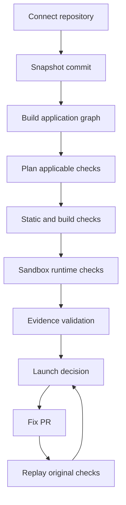
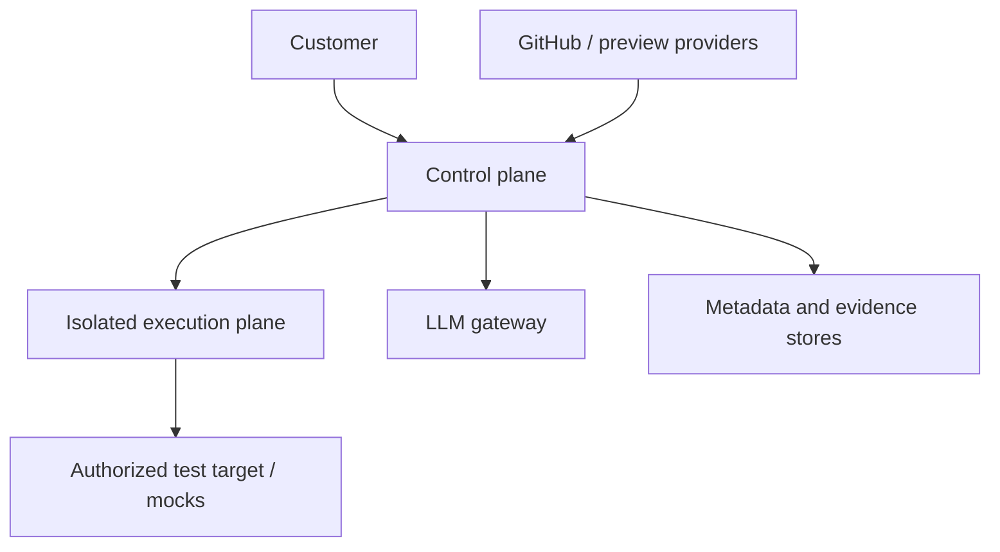
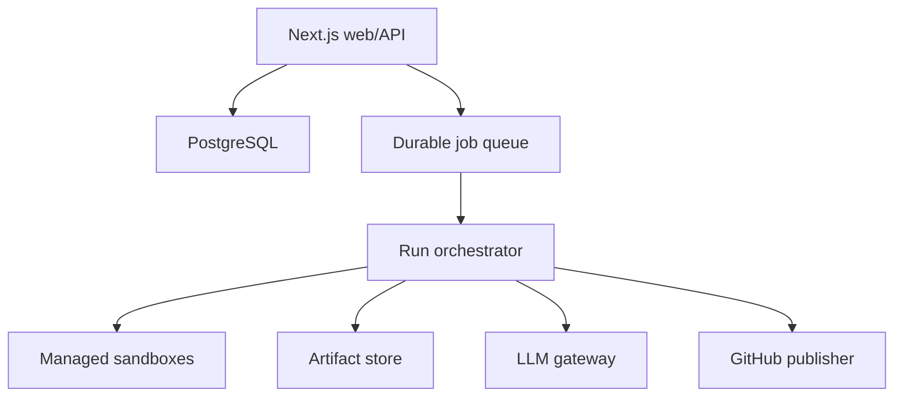

# VibeOps — Full Product, Technical, and Go-to-Market Specification

**Status:** Build-ready product specification

**Version:** 1.0

**Date:** 28 August 2026

**Product name:** “VibeOps” is a working codename only; see §4.4
**Initial release:** Evidence-backed launch verification for AI-built Next.js applications

---

## 0. Executive summary

AI coding tools have made a working prototype cheap. They have not made it equally cheap to determine whether that prototype can safely handle real users, money, credentials, and data. VibeOps is the verification layer between an AI-built application and a launch decision.

The initial product is not a generic AI reviewer, an enterprise AppSec suite, a penetration-test replacement, an observability platform, or an autonomous deployment system. It is a narrow, opinionated **launch verification product** for a common AI-builder stack:

- GitHub
- Next.js and TypeScript
- Vercel or a locally executable Next.js deployment
- Supabase
- Stripe in test mode

The product connects to a repository, constructs a typed model of the application, executes the application in a disposable hardened sandbox, selects applicable deterministic checks, exercises critical flows, and returns an evidence-backed launch decision. When a supported issue can be repaired safely, VibeOps creates a pull request, adds or updates tests, replays the exact failing check, and shows whether the evidence changed.

### 0.1 Core promise

> **Know what will block your launch—and prove the fix worked.**

Supporting line:

> VibeOps verifies the security, auth, data, payments, and critical user flows of AI-built web apps before real users depend on them.

### 0.2 The product's smallest valuable loop

```text
Connect repo → model app → run bounded checks → show evidence → create fix PR → replay check
```

The report answers four questions:

1. What was actually checked?
2. What failed, with what evidence?
3. What was not checked or could not be proven?
4. Did the proposed fix remove the original failure without breaking the baseline?

### 0.3 Critical product decisions

1. **Evidence precedes explanation.** An LLM may interpret or prioritize evidence, but it may not invent a finding.
2. **Coverage and readiness are separate.** An untested payment flow is unknown, not passed.
3. **Gate status matters more than a score.** A confirmed critical failure blocks launch even if the aggregate score is 94.
4. **Probable findings do not block by default.** Only confirmed or high-confidence failures can fail the default policy.
5. **No intrusive production testing in the MVP.** Active tests run in a VibeOps sandbox or an explicitly authorized preview/test environment. Production URLs receive passive checks unless a later, separately controlled feature is enabled.
6. **No custom microVM fleet in the MVP.** Use a managed sandbox service with gVisor or Firecracker-class isolation, restrictive egress, short lifetimes, and per-run quotas.
7. **No swarm of free-running agents.** One constrained planner coordinates versioned checks and deterministic tools. A separate critic validates the evidence package. The LLM never receives unrestricted shell or network authority.
8. **Fixes are pull requests, never silent production mutations.** Auto-merge and auto-deploy are off.
9. **The initial commercial wedge is agencies and serious solo SaaS builders.** Agencies have recurring launches, reputational risk, and multiple repositories; solo builders keep the product legible and self-serve.
10. **“VibeOps” must not ship as the public brand without legal clearance.** Multiple active, overlapping developer products already use the term.

### 0.4 Initial launch decision vocabulary

| Status | Meaning |
| --- | --- |
| **Blocked** | At least one applicable blocking rule failed with confirmed or high-confidence evidence. |
| **At risk** | No hard blocker was proven, but important failures, low coverage, or unresolved run errors remain. |
| **Ready with exceptions** | All blocking rules passed; explicit, time-bounded exceptions remain. |
| **Ready for tested scope** | All blocking rules passed and minimum coverage was reached for the declared launch scope. This is not a claim of complete security. |
| **Insufficient evidence** | The run did not execute enough applicable checks to support a readiness judgment. |

Customer-facing language must say:

> No blocking issues were detected within the checks and environments shown in this report.

It must never say:

> Your application is safe, secure, bug-free, compliant, or certified.

---

## 1. Problem research

### 1.1 Structural change

AI-assisted development is mainstream, but confidence has not followed adoption. The 2025 Stack Overflow Developer Survey reported that more respondents distrusted AI-tool accuracy than trusted it, while JetBrains reported broad regular use of AI development tools. Veracode's 2025 controlled code-generation evaluation found that 45% of generated samples failed its security tests. These studies measure different populations and tasks, so they must not be combined into a market-size claim; together they support a narrower conclusion: **generation is abundant, verification remains necessary**.

The economic bottleneck moves through this chain:

```text
Idea → working code becomes cheaper
Working code → trusted launch does not
Review, testing, security, data safety, and operations become the constraint
```

### 1.2 User problem

The initial customer can usually answer “does the happy path work on my machine?” They often cannot answer:

- Can one user read or modify another user's records?
- Is a privileged Supabase key present in a browser bundle?
- Does a supposedly protected route enforce authorization on the server?
- Can a Stripe webhook be forged, replayed, or processed twice?
- Will a migration delete or corrupt existing data?
- What happens when an external API times out?
- Does the production build match the local development experience?
- Are critical forms operable on mobile and by keyboard?
- Are errors observable after launch?

The user does not primarily want a vulnerability feed. They want a defensible decision: **launch, fix first, or accept a named risk**.

### 1.3 Why existing workflows fail the initial ICP

| Existing approach | Strength | Gap for this ICP |
| --- | --- | --- |
| Ask the coding agent to review its work | Fast and contextual | Same model class may repeat its assumptions; evidence and runtime reproduction are weak. |
| Linters and type checkers | Deterministic and cheap | Cover only a subset of runtime, authorization, payment, and operational risk. |
| SAST/SCA/secret scanners | Strong within their domains | Produce category-specific alerts, not a launch decision or business-flow verification. |
| AI PR reviewers | Excellent workflow fit | Primarily change review; usually do not provision and exercise the entire application. |
| DAST/pentesting tools | Can verify exploitable behavior | Setup and interpretation are difficult; may lack repository, data-model, and business-flow context. |
| Production-readiness scorecards | Good for established teams and service standards | Typically aggregate existing operational metadata rather than create a disposable app and prove its core behavior. |
| Human security/readiness audit | High judgment and broad scope | Expensive, slow, and not continuous. |

### 1.4 Root causes VibeOps must design around

1. **Missing context:** scanners do not know which routes, tables, roles, and payment events matter.
2. **Unverifiable AI claims:** natural-language review can sound certain without proof.
3. **Tool fragmentation:** a founder cannot synthesize eight security and QA products into one launch decision.
4. **Environment mismatch:** code may pass static review and fail during installation, build, migration, or runtime.
5. **Business-logic defects:** authorization and payments depend on relationships and state, not only patterns.
6. **Unknown scope:** a green score can hide checks that never ran.
7. **Unsafe remediation:** an automated fix may close an alert while breaking another path.

### 1.5 Research caveats

- Published percentages about “AI-generated code vulnerabilities” vary by language, prompt, model, benchmark, and definition. Marketing must not repeat an aggregate percentage without the study design.
- Public URL scanners cannot reliably infer private repository behavior or Supabase RLS correctness from headers alone.
- Static absence of an authorization wrapper is not proof that a route is exploitable; it is a high-confidence candidate until control flow or a two-user runtime test proves it.
- Automated accessibility tools identify only a subset of WCAG issues. VibeOps may report detected violations, not WCAG conformance.
- A successful bounded scan is not a penetration test and must not be sold as one.

---

## 2. Market research and opportunity

### 2.1 Category

Recommended category:

> **AI-built application launch verification**

Longer-term category:

> **AI software production-readiness control plane**

“AI security scanner” is too crowded and too narrow. “DevSecOps” signals enterprise complexity. “Production readiness” is directionally correct but already used by internal developer portals to describe service scorecards. The differentiated phrase is **verified launch evidence**.

### 2.2 Initial market segments

| Segment | Pain frequency | Willingness to pay | Sales friction | Priority |
| --- | ---: | ---: | ---: | ---: |
| Small AI-native web agencies shipping client apps | High | High | Medium | **1** |
| Solo founders launching paid/data-bearing SaaS | Medium | Medium | Low | **2** |
| Seed-stage teams without security/SRE staff | High | High | Medium | **3** |
| Designers/PMs experimenting with prototypes | Low until launch | Low | Low | Acquisition, not core revenue |
| Established engineering organizations | High but already tooled | High | High | Later |
| Regulated enterprises | Very high | Very high | Very high | Explicitly not MVP |

The primary commercial ICP should be an agency with 3–20 AI-assisted web launches per quarter. The primary product persona remains a technically shallow founder because a product that person can understand will also reduce agency review time.

### 2.3 Bottom-up opportunity model

Do not present a fabricated top-down TAM. Validate a bottom-up wedge:

| Assumption | Conservative validation target |
| --- | ---: |
| Agencies or builders contacted in first 90 days | 100 |
| Qualified conversations | 30 |
| Repositories manually audited | 20 |
| Audits revealing at least one actionable launch blocker | ≥60% |
| Users who ask for re-scan or continuous checks | ≥35% |
| Concierge audit willingness to pay | ≥$149 |
| SaaS conversion after an audit | ≥20% |

A credible first business is 250 Studio customers at $149/month, approximately $447,000 ARR before usage overage. The point of the wedge is not that this is the final market; it proves recurring willingness to pay and supplies the verified failure corpus needed for expansion.

### 2.4 Market timing

- AI coding adoption creates more software and a larger population of builders without traditional review support.
- Developer distrust creates demand for independent verification.
- Managed sandboxes make safe execution accessible to a small team.
- GitHub Apps, preview deployments, Supabase, and Stripe expose enough machine-readable structure to support a vertical check pack.
- The opportunity is time-sensitive: source-control platforms, AppSec vendors, and direct “vibe security” startups are already adding AI triage, fixes, and runtime testing.

---

## 3. Competitive landscape

### 3.1 Landscape map

| Category / examples | Code and dependency analysis | Runtime / browser | Business-flow context | Production-readiness policy | Fix plus exact re-verification | Initial buyer |
| --- | --- | --- | --- | --- | --- | --- |
| GitHub Advanced Security, Snyk, Semgrep | Strong | Limited/partnered | Low–medium | Security policy | Increasingly strong | Engineering/security teams |
| CodeRabbit and AI PR reviewers | Strong on diffs | Limited | Medium repository context | PR gates | Strong, improving rapidly | Developers/teams |
| Aikido, StackHawk, ZAP-based platforms | Strong security breadth | Strong DAST | Medium | Security gates | Varies | DevSecOps teams |
| Cortex and OpsLevel | Ingests tool signals | Via integrations | Service metadata | Strong scorecards | Workflow-oriented | Platform engineering |
| Direct vibe-code scanners: Revibed, Scout, Scault, ScanVibe, VibeShield, VibeScan | Usually secrets/SAST/config; some claim DAST and sandboxes | Varies | Often shallow | Simple grades | Prompts or auto-fixes | Vibe coders |
| Human production-readiness/security audits | Broad | Broad | High | Manual judgment | Human re-test | Funded founders/teams |
| **Proposed product** | Stack-specific and versioned | Bounded, sandboxed, flow-aware | **High for Next/Supabase/Stripe** | **Launch gate with coverage** | **Required replay of original evidence** | Agencies and serious AI builders |

### 3.2 Competitive facts that affect the strategy

- GitHub now sells separate secret-protection and code-security products and includes AI autofix capabilities. Competing on generic SAST, dependency alerts, or “AI explains the issue” is untenable.
- Semgrep and Snyk offer low-cost or free entry tiers. VibeOps should ingest or orchestrate deterministic engines rather than recreate them.
- CodeRabbit has moved beyond comments into tests, fixes, security, and agent loops. “AI code review with one-click fix” is not a unique category.
- Cortex and OpsLevel already frame production readiness as continuously evaluated scorecards. VibeOps must create evidence for a specific application and launch scope, not merely aggregate tool presence.
- Numerous direct products now market specifically to vibe coders. A prettier grade and 20 secret/header checks will be commoditized.

### 3.3 Defensible whitespace

The product has a credible wedge only if all five are true:

1. **Stack depth:** it understands Next.js route boundaries, Supabase roles/RLS, Stripe events, and Vercel-style configuration better than generic scanners.
2. **Evidence:** confirmed findings include a reproducible trace or deterministic proof.
3. **Coverage accounting:** the report reveals what was applicable, executed, skipped, errored, or untestable.
4. **Business flows:** it can model two-user authorization, payment replay, and migration behavior.
5. **Closed-loop remediation:** it replays the original failure against the proposed patch and reports regressions.

Without those properties, the product is another scanner and should not be built.

---

## 4. Positioning, message, and naming

### 4.1 Positioning statement

For AI-native web agencies and founders who need to launch software without a security or SRE team, VibeOps is an application launch-verification platform that executes the app, checks the risks specific to its architecture, and proves whether a fix worked. Unlike generic scanners or AI reviewers, it produces a scoped launch decision with reproducible evidence and explicit coverage.

### 4.2 Message hierarchy

1. **Outcome:** Know what blocks launch.
2. **Mechanism:** Repository analysis plus sandboxed runtime verification.
3. **Trust:** Every blocking issue links to evidence and reproduction.
4. **Action:** Create a fix PR and re-run the same proof.
5. **Boundary:** A scoped verification, not a security guarantee.

### 4.3 Recommended copy

Hero:

> **Before you launch AI-built software, make it prove itself.**

Subhead:

> Connect a Next.js repository. Verify auth, data, payments, security, and critical flows. Fix launch blockers with pull requests that are tested against the original failure.

CTA:

> **Run a Launch Check**

Avoid:

- “Secure in 30 seconds”
- “Production-grade automatically”
- “Pentest your app with AI”
- “100% safe”
- “Replace your security team”

### 4.4 Naming decision

“VibeOps” is not a viable assumed public name. As of this specification, overlapping products exist at `vibeops.tech`, `vibeops.ai`, `vibe-ops.ai`, and other domains. One directly describes itself as an AI production engineer for AI-generated code. This creates search, trademark, partnership, and user-confusion risk.

Required action before public beta:

1. Treat VibeOps as an internal codename.
2. Run a naming sprint around “proof,” “launch,” “ship,” “gate,” or “ready.”
3. Check company registries, trademarks in launch jurisdictions, package registries, GitHub organizations, app marketplaces, and `.com`/relevant domains.
4. Obtain legal clearance before spending on identity or content.

The rest of this document uses VibeOps only for readability.

---

## 5. Ideal customer profile and personas

### 5.1 Primary ICP: AI-native web agency

**Company:** 2–20 people, ships Next.js/Supabase client projects, uses AI coding agents heavily, lacks a dedicated AppSec or SRE function.

**Trigger:** A client app will start accepting users, personal data, payments, or contractual traffic.

**Current workaround:** Senior developer checklist, scattered free scanners, manual browser testing, or an occasional contractor audit.

**Buyer:** Founder, technical lead, or delivery lead.

**Value:** Fewer senior-review hours, repeatable client handoff, evidence for launch conversations, and continuous regression protection.

### 5.2 Secondary ICP: serious solo SaaS founder

**Profile:** Uses Lovable, Replit, Cursor, Claude Code, Codex, Grok, or similar tools; understands product but not all backend/security implications; has a GitHub repo; is about to collect real data or money.

**Value:** A plain-language answer about the highest-risk failures and a safe path to fix them.

### 5.3 Tertiary ICP: seed-stage product team

**Profile:** 3–15 engineers or hybrid builders, fast release cadence, no dedicated security engineer, needs a GitHub status check and auditable exceptions.

### 5.4 Anti-ICP for the MVP

- Non-web or mobile-native applications
- Repositories without permission to execute or test
- Complex monorepos and microservice estates
- Kubernetes, custom VPC, or on-prem deployments
- Healthcare, payments infrastructure, banking, government, or other regulated systems expecting compliance assurance
- Customers demanding source-code locality, self-hosting, SSO, SCIM, or custom retention
- Production-only systems with no safe preview/test environment
- Requests for unbounded or third-party penetration testing

---

## 6. Jobs to be done

### 6.1 Core functional job

> When my AI-built application is about to handle real users, data, or money, help me determine what would make launch irresponsible, show me proof I can understand, and verify that the repair actually worked.

### 6.2 Supporting jobs

- When a pull request changes auth, data, or payments, tell me whether it introduced a new verified risk.
- When a scanner flags something, tell me whether it is relevant to this architecture and reachable in this app.
- When a fix PR is proposed, show me the exact test that changed from fail to pass.
- When a check cannot run, tell me why and what access or setup would increase coverage.
- When I knowingly accept a risk, record who accepted it, why, and when the exception expires.
- When handing an app to a client, export a scoped, timestamped readiness report without implying certification.

### 6.3 Emotional and social jobs

- Replace vague launch anxiety with a bounded decision.
- Give a non-expert language for discussing risk with a client or cofounder.
- Avoid appearing careless when software was built quickly with AI.
- Preserve human control over code changes and deployment.

---

## 7. Product principles and scope

### 7.1 Product principles

1. **Unknown is visible.** Skipped, errored, and untestable checks are first-class results.
2. **Evidence is immutable.** Explanations can improve; raw, redacted proof from a run does not change.
3. **Risk is contextual.** A missing rate limiter on password reset differs from one on a public health check.
4. **Tools are versioned.** Every result records the rule version, runner image digest, and commit SHA.
5. **Permissions are minimal and phase-bound.** Clone credentials, build network access, runtime secrets, and PR-write credentials never coexist inside untrusted execution.
6. **Production is protected.** Active mutation, replay, brute-force, and destructive tests are prohibited on production in the MVP.
7. **Fixes earn trust through replay.** “Patch applied” is not “issue fixed.”
8. **Simple for the user, explicit underneath.** The UI hides tool sprawl but exposes scope, evidence, and uncertainty.

### 7.2 MVP outcome

A first-time user can connect a supported repository and receive a useful Launch Check without authoring configuration. A deeper run can be enabled by connecting an approved preview environment and test personas.

### 7.3 MVP scope

**Supported:**

- One Next.js application per repository
- TypeScript-first; JavaScript tolerated when tooling supports it
- App Router and Pages Router
- Node.js 20 or 22
- `npm`, `pnpm`, or Yarn with a committed lockfile
- Public npm registry dependencies
- GitHub-hosted repositories
- Vercel preview URL or a locally startable production build
- Supabase clients, SQL migrations, auth usage, and RLS policy definitions visible in repo
- Stripe SDK and webhook code; all active tests use Stripe test mode or local signed fixtures
- Playwright-compatible web flows

**Supported with explicit configuration:**

- Test accounts/personas
- Preview-environment base URL
- Synthetic seed commands
- Non-secret required environment variables
- Short-lived test secrets delivered through the secret broker
- Allowed external domains required during build or test

**Unsupported:**

- Monorepos with more than one deployable app
- Docker Compose, Kubernetes, arbitrary system services, or privileged builds
- Private package registries
- Native mobile, desktop, browser extensions, games, or smart contracts
- Live payment mutations
- Production database migrations or destructive production tests
- Compliance certification

---

## 8. Supported MVP stack and compatibility contract

| Layer | Supported contract | Detection evidence |
| --- | --- | --- |
| Source | GitHub repository and immutable commit SHA | GitHub installation and commit metadata |
| Framework | Next.js with conventional build/start scripts | `package.json`, Next config, route tree, build output |
| Language | TypeScript/JavaScript | `tsconfig`, file extensions, package metadata |
| Package manager | npm, pnpm, Yarn with lockfile | Lockfile and `packageManager` field |
| Hosting | Local sandbox; optional Vercel preview | config files, environment metadata, verified URL ownership |
| Auth/data | Supabase Auth/Postgres/Storage when detectable | imports, clients, migrations, policies, env names |
| Payments | Stripe test-mode integration | imports, routes, webhook handlers, env names |
| Browser | Chromium in MVP | Playwright trace, console, network, screenshots |
| Standards | OWASP ASVS 5.0 references, OWASP API Top 10, WCAG 2.2 mappings, NIST SSDF vocabulary | Check-definition metadata |

Compatibility is not binary. The intake step produces:

- **Fully supported:** all core assumptions detected.
- **Partially supported:** useful static/build checks can run; deeper checks are unavailable.
- **Unsupported:** the application cannot be executed safely or interpreted reliably.

Unsupported projects receive a clear explanation and are not charged for a deep run.

---

## 9. End-to-end product loop



### 9.1 Run phases

| Phase | Purpose | Credentials and network |
| --- | --- | --- |
| 0. Intake | Validate authorization, repository support, declared scope | Control plane only; no user code execution |
| 1. Snapshot | Acquire immutable source and metadata | Short-lived GitHub installation token in isolated fetch service; token destroyed after snapshot |
| 2. Inventory | Parse architecture and select checks | No customer secrets; network off |
| 3. Static analysis | Run secret, dependency, code, config, and migration checks | No secrets; network off except scanner advisory DB through controlled service |
| 4. Dependency install/build | Reproduce production build | No customer runtime secrets; egress allowlisted to package registries and declared sources |
| 5. Local runtime | Start app with synthetic or brokered test configuration | Lease-scoped secrets; egress default deny; localhost allowed |
| 6. Dynamic/browser | Exercise routes and declared flows | Only authorized sandbox/preview target; request, time, and mutation budget enforced |
| 7. Synthesis | Normalize and validate evidence | Relevant redacted snippets only; no shell authority |
| 8. Policy | Calculate coverage, readiness, and gate result | Deterministic policy evaluator |
| 9. Cleanup | Delete execution environment and expire leases | Mandatory even after failure |

### 9.2 Run state machine

```text
queued → acquiring → inventorying → analyzing → building → starting
→ testing → validating → scoring → completed
```

Terminal alternatives:

```text
unsupported | cancelled | timed_out | failed_infrastructure | failed_configuration
```

An application failure is a check result. A VibeOps infrastructure failure is not. The system must never convert its own timeout or crash into a customer finding.

---

## 10. Repository understanding and application graph

### 10.1 Goal

Create a typed, versioned model that is sufficient to decide which checks apply and where evidence should be collected. This is not a general semantic knowledge graph.

### 10.2 Node types

- application
- page/route
- route handler or server action
- middleware
- client component
- server component
- auth provider/client
- role/persona
- database table/view/function
- RLS policy
- storage bucket
- migration
- external API
- webhook
- payment product/price reference
- environment variable
- background job
- file upload surface
- deployment environment

### 10.3 Edge types

- `calls`
- `imports`
- `reads_from`
- `writes_to`
- `authenticates_with`
- `authorizes_role`
- `exposes_to_client`
- `receives_webhook_from`
- `redirects_to`
- `depends_on_env`
- `created_by_migration`
- `protected_by_policy`
- `deployed_to`

### 10.4 Detection pipeline

1. Read package manifests, lockfiles, TypeScript config, Next config, and deployment files.
2. Enumerate App/Pages Router paths, route handlers, middleware, server actions, and API endpoints.
3. Parse imports and calls using TypeScript compiler APIs and targeted AST queries.
4. Detect Supabase client construction, key sources, SQL migrations, RLS declarations, functions, and storage policies.
5. Detect Stripe client initialization, checkout/session creation, webhook endpoints, signature verification, fulfillment paths, and amount sources.
6. Identify candidate roles from auth claims, middleware, route guards, and database policies.
7. Record confidence and provenance for every node and edge.
8. Ask the user only about missing facts that materially change test planning: critical flows, test roles, or preview ownership.

### 10.5 Architecture-map output

Example:

```text
Next.js web application
├── Browser routes: /, /pricing, /dashboard, /admin
├── Server routes: /api/checkout, /api/admin/users, /api/stripe/webhook
├── Supabase Auth: anonymous, authenticated, admin claim
├── Supabase Postgres: profiles, subscriptions, projects
├── Supabase Storage: avatars
├── Stripe: Checkout + customer.subscription.* webhooks
└── Email: Resend
```

Every displayed edge links to its detection evidence. Users can correct a mistaken node or classify a route as intentionally public; corrections are versioned and influence future plans.

### 10.6 Architecture confidence

Each graph element has:

- `detected`: deterministic source/config evidence
- `inferred`: strong relationship inferred from code/data flow
- `declared`: provided by user
- `unresolved`: conflicting or incomplete evidence

LLM-derived relationships cannot be promoted to `detected` without a deterministic trace.

---

## 11. Modular check architecture

### 11.1 Check registry

Every check is a versioned, signed definition. A check definition contains:

```yaml
id: stripe.webhook.signature.v1
version: 1.3.0
title: Stripe webhook verifies the raw signed payload
category: payments
applicability:
  all:
    - graph.has_integration: stripe
    - graph.has_node_type: webhook
runner:
  kind: composite
  image_digest: sha256:...
  timeout_seconds: 120
  permissions:
    network: none
    secrets: [synthetic_stripe_signing_secret]
evidence_schema: stripe_webhook_signature_evidence.v1
standards:
  - OWASP-ASVS-v5.0.0: <mapped requirement maintained in registry>
default_severity: critical
blocking_eligible: true
fix_strategy: assisted
```

The production registry also records:

- supported stack versions
- deterministic tools and versions
- expected inputs and artifacts
- maximum CPU, memory, process, file, request, and network budgets
- confirmation rule
- known false-positive conditions
- redaction rules
- fixture corpus version
- rollout channel: experimental, beta, stable, deprecated

### 11.2 Check lifecycle

```text
draft → fixture-tested → shadow → beta/non-blocking → stable/blocking-eligible → deprecated
```

A check may become blocking-eligible only when:

- it has deterministic confirmation criteria;
- it passes all positive, negative, and adversarial fixtures;
- sampled precision is at least 98% for confirmed/high-confidence results;
- infrastructure errors remain below 2% on supported repositories;
- the support team has a documented false-positive and rollback procedure.

### 11.3 Applicability and result states

Every applicable check returns exactly one state:

- `pass`
- `fail`
- `not_applicable`
- `skipped_user_configuration`
- `skipped_safety_policy`
- `error_application`
- `error_vibeops`
- `inconclusive`

`error_application` can contribute evidence to a build/runtime finding. `error_vibeops` reduces coverage and may trigger a credit refund; it never reduces readiness.

### 11.4 Composite checks

High-value checks often combine evidence:

```text
Candidate route from AST
→ route sensitivity inferred from data writes / admin naming / graph
→ auth guard control-flow analysis
→ two-persona runtime request
→ database or response comparison
→ confirmed authorization finding
```

The AI planner may select this pipeline but cannot waive the required evidence stages for a confirmed result.

### 11.5 Check-pack boundary

The MVP has one maintained pack: `next-supabase-stripe`. Generic tools feed the pack, but the product does not claim equal support for other frameworks. New packs require their own fixtures, compatibility contract, and adoption data.

---

## 12. MVP check catalog

The catalog contains 34 checks: 20 P0 checks required for the first paid beta and 14 P1 checks for the complete MVP. “Default severity” is a starting point; final severity considers the affected asset, data, role, and reachability.

### 12.1 Build, configuration, and supply chain

| ID | Priority | Check | Method and required evidence | Default severity |
| --- | --- | --- | --- | --- |
| `BUILD-001` | P0 | Reproducible dependency install | Detect one lockfile, run frozen install in clean sandbox, record command and exit. Missing lockfile is medium; failed frozen install is high. | Medium/High |
| `BUILD-002` | P0 | Production build succeeds | Execute declared production build with synthetic placeholders where safe; preserve redacted log and exit code. | High |
| `BUILD-003` | P0 | TypeScript check succeeds | Run repository script or `tsc --noEmit` when compatible; separate pre-existing baseline from new PR failures. | Medium |
| `CONFIG-001` | P0 | Required environment variables are declared and scoped | Compare code references, validation schema, example env, and supplied preview configuration. Never display values. | High |
| `SECRET-001` | P0 | No tracked or historical high-confidence secret | Gitleaks-compatible history and working-tree scan; fingerprint, path, commit, provider pattern, and redacted match. Do not validate a secret externally by default. | Critical |
| `SECRET-002` | P0 | No secret or privileged key in client bundle | Inspect compiled browser assets and source maps for privileged patterns and known secret env sources. Match must be present in emitted client artifact. | Critical |
| `DEP-001` | P0 | No applicable critical known vulnerability in production dependency | OSV-Scanner against lockfile; filter dev-only packages and use import/reachability evidence when available. Unknown reachability lowers confidence, not CVE severity. | High/Critical |

### 12.2 Authentication, authorization, and API security

| ID | Priority | Check | Method and required evidence | Default severity |
| --- | --- | --- | --- | --- |
| `AUTHZ-001` | P0 | Sensitive server route rejects anonymous access | Identify sensitive route and show anonymous request response or statically proven guard. A naming heuristic alone is only probable. | Critical |
| `AUTHZ-002` | P0 | Object-level authorization isolates users | With two synthetic personas, create/read/update object A as user A and replay as user B. Confirm only with cross-user response or database-state evidence. | Critical |
| `AUTHZ-003` | P0 | Ordinary user cannot invoke admin function | Exercise candidate admin route/action with ordinary persona and compare to admin persona. | Critical |
| `AUTH-001` | P1 | Session cookie and logout semantics are safe | Inspect `Secure`, `HttpOnly`, `SameSite`, expiry, token storage, and logout invalidation in preview/local environment. | High |
| `AUTH-002` | P1 | Password reset/login abuse has bounded controls | Static detection plus a low-volume test within a strict request budget; no brute force. Absence without runtime proof is probable. | High |
| `API-001` | P0 | Credentialed CORS is not broadly permissive | Inspect response headers/config and send bounded preflight requests from an untrusted origin. | High |
| `API-002` | P1 | Redirect and callback destinations are allowlisted | Trace user-controlled redirect inputs and test an external destination with a non-authenticated fixture. | High |
| `API-003` | P1 | Untrusted input does not reach dangerous query/command sink | Semgrep/AST taint candidate plus targeted request where safe. Confirmed only with deterministic flow or harmless runtime proof. | Critical |
| `API-004` | P1 | Server-side URL fetch blocks internal destinations | Trace URL inputs; test only reserved/non-routable and sandbox-owned targets. Never probe customer or cloud metadata networks. | High |
| `UPLOAD-001` | P1 | Uploads enforce authorization, size, type, and safe names | Inspect handler/storage policy and submit inert boundary fixtures. No malware payloads. | High |

### 12.3 Supabase and data safety

| ID | Priority | Check | Method and required evidence | Default severity |
| --- | --- | --- | --- | --- |
| `SUPA-001` | P0 | Service-role/secret key is server-only | Trace client construction and env sources; inspect emitted bundle. Supabase documents that secret/service-role access bypasses RLS. | Critical |
| `SUPA-002` | P0 | RLS is enabled on exposed user-data tables | Parse migrations/schema; compare grants and RLS declarations for tables reached by browser/server clients. Live confirmation only on disposable DB. | Critical |
| `SUPA-003` | P0 | RLS policy enforces tenant/user boundary | Analyze `USING`/`WITH CHECK`, role grants, and auth identity predicates; confirm using two-persona database/API test when an ephemeral database is available. | Critical |
| `SUPA-004` | P1 | Storage bucket and object policies match declared privacy | Parse storage migrations/policies and exercise inert object access in a disposable project. | High |
| `DATA-001` | P0 | Migration has no unguarded destructive operation | Parse SQL for drops, truncation, destructive type changes, unbounded delete/update, and unsafe constraint changes; include exact statement and affected object. | Critical/High |
| `DATA-002` | P1 | Migration applies to a populated fixture and is repeatable | Apply migrations to ephemeral Postgres with representative synthetic rows, record schema/data diff, then replay according to migration contract. | High |

### 12.4 Stripe and payment integrity

| ID | Priority | Check | Method and required evidence | Default severity |
| --- | --- | --- | --- | --- |
| `PAY-001` | P0 | Webhook verifies Stripe signature against raw body | Static control-flow proof plus locally signed valid/invalid payloads. Stripe requires the raw body for verification. | Critical |
| `PAY-002` | P0 | Webhook processing is replay-safe | Deliver the same signed event twice and compare durable side effects; Stripe documents duplicate delivery and non-guaranteed event order. | Critical |
| `PAY-003` | P0 | Price and amount are determined server-side | Trace client-controlled fields into Checkout/PaymentIntent calls and compare to server-side catalog/allowlist. | Critical |
| `PAY-004` | P1 | Entitlement/fulfillment follows verified payment state | Trace provisioning to a verified webhook/server retrieval, not solely a success redirect or client flag. | Critical |
| `PAY-005` | P1 | Test/live configuration is separated | Detect mixed test/live key prefixes, preview use of live credentials, and client exposure. Never execute a live charge. | Critical |

### 12.5 Runtime, UX, accessibility, and operations

| ID | Priority | Check | Method and required evidence | Default severity |
| --- | --- | --- | --- | --- |
| `RUN-001` | P0 | Critical routes render without 5xx or fatal console errors | Crawl graph-discovered routes; capture status, console, page error, and Playwright trace. Intentional 401/403/404 is classified by route contract. | High |
| `RUN-002` | P0 | Declared critical journey completes | Generate a proposed flow, let user edit/approve it, then run it. MVP templates: signup/login/logout, create primary object, checkout test flow. | High |
| `REL-001` | P1 | Critical UI/API handles dependency failure and timeout | Route selected dependencies to controlled failure fixtures; assert bounded timeout, non-sensitive error, and recoverable UI. | High |
| `A11Y-001` | P1 | No critical/serious automated accessibility violation on critical pages | axe-core plus form-label and keyboard-smoke assertions; map to WCAG 2.2. Never claim full conformance. | Medium/High |
| `UX-001` | P1 | Critical pages avoid blocking responsive defects | Test 320, 375, 768, and 1280 px widths for horizontal overflow, hidden primary action, clipped dialog, and unusable form. Store screenshots only on failure. | Medium |
| `OPS-001` | P1 | Minimum launch observability is present | Detect structured server error logging, error capture integration, and a usable health signal where architecture permits. Absence is advisory unless policy requires it. | Medium |

### 12.6 Explicitly excluded checks

The MVP does not attempt automated proof of:

- complete OWASP ASVS compliance;
- business continuity, disaster recovery, or actual restore success;
- production backup configuration without a provider integration;
- load capacity or denial-of-service resistance;
- exhaustive XSS/SQLi/SSRF fuzzing;
- mobile Safari/Firefox parity;
- legal privacy compliance;
- secure SDLC maturity;
- malicious package behavior beyond bounded install observation;
- vulnerabilities requiring destructive exploitation.

---

## 13. Evidence, issue, and confidence model

### 13.1 Finding versus observation

- **Observation:** raw output or behavior from a tool or run step.
- **Finding candidate:** one or more observations normalized to a potential issue.
- **Finding:** a candidate that meets the evidence contract for its assigned confidence.
- **Policy violation:** a finding or coverage state that fails a configured rule.

This separation prevents a raw scanner line from automatically becoming a customer-facing blocker.

### 13.2 Confidence levels

| Confidence | Contract | May block by default? |
| --- | --- | --- |
| **Confirmed** | Reproduced at runtime or proven by a deterministic static/configuration rule with no material alternative path. | Yes |
| **High confidence** | Strong deterministic evidence and reachability/context, but safe reproduction is unavailable. | Yes, for selected checks |
| **Probable** | Reasoned risk with incomplete proof or architecture ambiguity. | No |
| **Advisory** | Best-practice or maturity gap; exploitation is not claimed. | No |

### 13.3 Severity levels

Severity and confidence remain independent.

| Severity | Meaning |
| --- | --- |
| Critical | Plausible unauthorized access to sensitive data/admin/payment behavior, privileged secret exposure, or irreversible data loss. |
| High | Material compromise, outage, incorrect payment/state, or important user-flow failure. |
| Medium | Limited-impact failure, important hardening gap, accessibility blocker, or operational weakness. |
| Low | Minor defect or localized improvement. |
| Info | Context without a requested change. |

### 13.4 Required fields for every finding

- stable finding fingerprint
- title and plain-language summary
- category, severity, confidence, and status
- affected commit and environment
- affected graph nodes and code locations
- applicability reason
- business/runtime impact
- evidence list with provenance and hashes
- safe reproduction steps
- redacted request/response or static trace where applicable
- recommended remediation
- automatic-fix eligibility and risk class
- standards mappings
- first seen, last seen, and recurrence history
- verification state
- suppression/exception history

### 13.5 Evidence types

- SARIF/static analyzer result
- AST/control-flow trace
- file/config/migration excerpt
- compiled bundle match
- command result with exit code
- HTTP transcript with secrets and personal data redacted
- browser trace, screenshot, console event, and network event
- database schema or synthetic state diff
- test assertion
- dependency advisory and lockfile path
- architecture graph proof

Every evidence object records:

```json
{
  "run_id": "run_...",
  "check_id": "PAY-002",
  "commit_sha": "...",
  "environment_id": "env_...",
  "source_kind": "http_transcript",
  "tool": "vibeops-stripe-replay",
  "tool_version": "1.2.0",
  "runner_image_digest": "sha256:...",
  "captured_at": "...",
  "sha256": "...",
  "redaction_version": "2",
  "retention_expires_at": "..."
}
```

### 13.6 Redaction

Redaction occurs before logs or artifacts leave the execution boundary. Rules cover:

- authorization headers and cookies
- JWTs and API keys
- email, phone, addresses, and user-provided fields
- database connection strings
- query parameters marked secret
- `.env` values

The UI may reveal that a secret exists and show the first/last safe characters only. Raw secret values are never stored as evidence.

### 13.7 Finding deduplication

Fingerprint:

```text
hash(check_family + normalized_sink_or_asset + normalized_route_or_symbol + tenant_scope)
```

Line numbers are not part of the stable identity. A finding instance connects the fingerprint to a commit and exact evidence. This enables recurrence tracking across refactors.

---

## 14. Readiness scoring and launch policy

### 14.1 Three outputs, not one score

Every report shows:

1. **Gate status:** the decision vocabulary from §0.4.
2. **Coverage:** how much applicable weighted scope was executed successfully.
3. **Dimension scores:** secondary summaries for executed checks only.

### 14.2 Dimensions

- Security
- Authentication and authorization
- Data safety
- Payments
- Reliability
- Runtime and UX
- Accessibility
- Operations

Dimensions not applicable to the architecture display `N/A`. Dimensions with less than 60% weighted coverage display **Insufficient evidence**, not a number.

### 14.3 Check weights

Each check definition has an importance weight based on the consequence of the control:

- critical control: 10
- high control: 5
- medium control: 2
- low/advisory control: 0.5

Weights belong to check definitions, not individual findings, and are reviewed with the check pack.

### 14.4 Coverage

```text
weighted coverage =
  sum(weight of applicable checks with pass/fail/inconclusive result)
  / sum(weight of all applicable checks)
```

`inconclusive` counts as executed for operational transparency but cannot satisfy a required policy rule. A separate **conclusive coverage** metric excludes inconclusive checks and controls the minimum threshold.

### 14.5 Dimension score

For executed checks:

| Outcome | Factor |
| --- | ---: |
| Pass | 1.00 |
| Advisory gap | 0.80 |
| Probable failure | 0.60 |
| High-confidence failure | 0.15 |
| Confirmed failure | 0.00 |
| Inconclusive | Excluded from score; included in coverage state |

```text
dimension score = 100 × sum(check weight × outcome factor) / sum(executed conclusive weights)
```

The headline score, if shown, is a weighted mean of eligible dimension scores. It is never used to override a gate.

### 14.6 Default Launch policy

A project is **Ready for tested scope** only when:

- no open confirmed/high-confidence critical finding exists;
- no open confirmed high finding exists in auth, data, or payments;
- `BUILD-002` passes;
- all applicable P0 checks complete or have an explicit approved exception;
- conclusive weighted coverage is at least 80%;
- the run targets the configured release commit;
- the report is not older than 7 days;
- no VibeOps infrastructure error affects a required check.

### 14.7 Exceptions

An exception requires:

- reason
- owner
- scope (finding/check/environment)
- expiry date, maximum 30 days in MVP
- compensating control
- optional ticket/PR URL

Expired exceptions reopen the policy violation automatically. Critical secret exposure and confirmed cross-tenant access cannot be excepted in the self-serve MVP; support escalation is required.

### 14.8 Policy-as-code direction

UI-managed policy is authoritative in the MVP. A later repository file can make policy reviewable with code:

```yaml
version: 1
extends: vibeops/default-launch
minimum_conclusive_coverage: 0.80
block:
  severities: [critical]
  confidences: [confirmed, high]
require:
  - BUILD-002
  - AUTHZ-001
  - SUPA-001
  - PAY-001
exceptions:
  max_days: 30
```

Repository policy cannot silently weaken organization policy. The effective policy is the stricter merge of organization, project, environment, and repository rules. Team plans should require protected review for policy-file changes.

---

## 15. Complete user flows

### 15.1 First Launch Check

1. User signs in with GitHub.
2. User installs the GitHub App and selects explicit repositories.
3. VibeOps lists accessible supported repositories.
4. User selects repository and branch/commit.
5. Intake detects stack and shows:
   - supported components;
   - unsupported components;
   - checks available now;
   - optional access needed for deeper checks.
6. User declares launch scope:
   - app purpose;
   - data sensitivity: none/basic personal/sensitive;
   - payments: none/test/live planned;
   - critical user flows;
   - preview or sandbox-only target.
7. User attests they own or are authorized to test the repository and target.
8. User starts the run and sees phase-level progress, not fabricated percent completion.
9. Report opens with gate, coverage, blockers, architecture, and untested scope.
10. User opens a finding, views evidence, and selects create fix PR, dismiss candidate, or accept eligible risk.

Acceptance condition: a supported static/build-only scan requires no manual config beyond scope; dynamic authorization/payment checks request configuration only when needed.

### 15.2 Preview environment and test personas

1. User chooses local sandbox or adds a preview URL.
2. VibeOps verifies target control through a Vercel/GitHub relationship or a one-time well-known challenge.
3. User declares environment as preview/test; production-like hostnames trigger warning and active-test refusal.
4. User supplies test personas via one of:
   - VibeOps-created disposable accounts in an ephemeral environment;
   - user-created credentials stored as leased secrets;
   - deterministic seed script producing session state.
5. User maps personas to roles: anonymous, user A, user B, admin.
6. VibeOps validates login without storing a reusable session beyond the run.
7. User previews the generated flows and can remove unsafe or irrelevant actions.

### 15.3 Finding triage

1. User selects finding.
2. Issue Detail shows summary, severity, confidence, affected surface, evidence, reproduction, impact, and check scope.
3. User can:
   - create fix PR;
   - copy a safe fix brief for their coding agent;
   - mark as not relevant and provide reason;
   - request re-check;
   - accept risk if policy permits;
   - report a false positive.
4. A reported false positive becomes `disputed`, does not disappear, and enters calibration review.

### 15.4 Fix PR

1. User selects **Create Fix PR**.
2. UI shows risk class and files likely to change.
3. A fresh sandbox checks out the same commit and generates a patch.
4. VibeOps adds or updates a regression test.
5. Baseline tests, build, the original check, and related high-risk checks run.
6. If the original failure remains or new blocker appears, no PR is opened; user sees a failed fix attempt.
7. If verification passes, a dedicated publisher service creates the branch and PR.
8. PR displays problem, risk, change, verification evidence, limitations, and rollback note.
9. Human reviews and merges. VibeOps never merges by default.

### 15.5 Pull-request gate (post-MVP beta)

1. GitHub webhook verifies signature and deduplicates delivery.
2. Changed files and application-graph impact select a fast check subset.
3. GitHub Check is `queued`, `in_progress`, then `success`, `neutral`, `failure`, or `action_required`.
4. Only new or worsened blocking findings fail the PR by default; existing baseline debt is shown separately.
5. Scheduled/deep run verifies the default branch periodically.

### 15.6 Risk acceptance

1. Eligible finding presents **Accept temporarily**.
2. User selects a reason and expiry and enters compensating control.
3. Policy is recomputed immediately.
4. Audit log records actor and before/after state.
5. Notifications fire before and at expiry.

### 15.7 Run failure

1. UI distinguishes app configuration failure from VibeOps failure.
2. User sees the failed phase, redacted evidence, and exact action required.
3. A platform fault automatically restores usage credit.
4. Retry reuses the source snapshot only if its hash and expiry remain valid; execution environments are never reused.

### 15.8 Project deletion

1. Owner selects delete project and reviews affected repos, results, artifacts, and integrations.
2. Confirmation revokes VibeOps project access, deletes retained source snapshots/artifacts according to policy, and tombstones audit references required for billing/security.
3. GitHub App uninstall is linked but cannot be silently performed for unrelated repositories.

---

## 16. Screen specifications

### 16.1 Global shell

**Navigation:** Projects, Runs, Fixes, Policies, Usage, Settings.

**Persistent indicators:** selected organization, active project, documentation/help, notifications, user menu.
**Global safety banner:** displayed when any target is classified as production or when active tests are disabled by policy.

### 16.2 Projects

**Purpose:** Portfolio-level view of repositories and current evidence.

**Primary components:**

- repository/project card or table row
- latest gate status and commit
- conclusive coverage
- open critical/high count
- last successful run and evidence freshness
- stack badges
- next action

**Filters:** gate, stack, stale evidence, owner, open blocker.

**Empty state:** Install GitHub App and run first Launch Check.
**Error state:** Repository access revoked; reauthorize without deleting history.

### 16.3 New Project / Intake

**Steps:** Repository → detected stack → launch scope → environment → personas/flows → review and run.

**Key UX rule:** Show why each question is needed and which checks it unlocks. Do not present a wall of DevOps terms.

**Review panel:**

- commit SHA
- target environment
- active/passive test mode
- allowed domains
- estimated execution time and included usage
- data mutation statement
- authorization attestation

### 16.4 Project Overview

**Above fold:**

- gate status
- sentence explaining the decisive reason
- conclusive and total coverage
- latest commit/environment
- primary actions: re-run, view blockers, configure missing coverage

**Sections:**

1. Blocking findings
2. Dimension results
3. Untested/failed scope
4. Architecture summary
5. Recent fixes and regressions
6. Run history

The numeric score is visually subordinate to gate and coverage.

### 16.5 Issues

**Columns:** severity, confidence, title, affected surface, state, first/last seen, fix eligibility.

**Filters:** category, severity, confidence, state, introduced by commit, auto-fixable, policy impact.

**Views:** all, blockers, new in release, disputed, accepted risk, resolved.
**Bulk actions:** limited to assign/export; no bulk suppression for critical findings.

### 16.6 Issue Detail

**Header:** severity, confidence, status, policy impact, affected commit.
**Tabs/sections:**

- Summary
- Evidence
- Reproduce
- Affected architecture
- Fix
- History

**Evidence view:** renders type-appropriate proof with redactions, tool provenance, and “what this proves / does not prove.”

**Primary CTA:** Create Fix PR when eligible; otherwise Generate Fix Brief.
**Secondary actions:** Re-run check, dispute, temporary exception.

### 16.7 Run Detail

**Purpose:** Auditable timeline and troubleshooting.

**Components:**

- phase timeline with timestamps
- commit, target, scope, policy, and check-pack versions
- check results grouped by state
- resource/usage summary
- redacted logs and artifacts
- cancellation/retry control

Do not stream raw ANSI/HTML from untrusted repositories directly into the browser. Normalize and escape terminal output.

### 16.8 Architecture

**Views:** simplified map, routes, data, auth/roles, integrations, environment variables.

**Interactions:** select node to show evidence; mark route public/sensitive; correct role; add critical-flow label.
**Versioning:** corrections create a new application-graph annotation, not a mutation of historical run evidence.

### 16.9 Fixes

**Columns:** finding, branch/PR, verification state, regression state, author, created, merged.

**States:** preparing, verification failed, ready for review, PR open, merged, closed, superseded.
**Detail:** patch summary, changed files, test delta, original check before/after, related checks, limitations.

### 16.10 Policies

**MVP:** one default policy with UI-managed thresholds and exception list.
**Later:** repository policy-as-code, environment-specific policies, required GitHub status checks, policy change review.

The UI must warn that editing policy to ignore a result changes the launch decision; it does not fix the issue.

### 16.11 Settings and integrations

- GitHub installation and repositories
- environments and ownership verification
- secrets as references with last-used/rotation metadata
- test personas
- allowed outbound domains
- data retention
- LLM data-processing disclosure/preferences
- notifications
- billing/usage
- delete/export controls

Secret values are write-only after creation.

### 16.12 Report export

Exported HTML/PDF contains:

- project, commit, environment, timestamp
- gate status and scope statement
- coverage and untested scope
- findings with redacted evidence
- accepted exceptions and expiry
- check-pack/tool versions
- limitation statement

The export footer says “Automated scoped verification; not a certification or penetration test.” A public badge is not part of the MVP.

---

## 17. Agent architecture

### 17.1 Design correction

The seed's many named agents should not become autonomous services in the MVP. Multiple free-running agents increase cost, latency, duplicated work, and uncertainty about authority. Use a **constrained orchestration pipeline** with narrow model roles.

### 17.2 Logical components

| Component | Responsibility | May execute tools? |
| --- | --- | --- |
| Inventory engine | Deterministic stack/route/data/integration detection | Fixed parsers only |
| Run planner | Select applicable registered checks and order dependencies | Registry queries only; no shell/network |
| Tool runners | Execute versioned deterministic checks | Only permissions declared by check |
| Flow author | Propose Playwright journeys from graph and templates | Produces schema-constrained flow; user approves sensitive actions |
| Evidence synthesizer | Convert valid evidence package into plain language | No new finding creation |
| Critic/verifier | Check evidence sufficiency, alternative explanations, redaction, severity/confidence consistency | Can request an allowed follow-up check; cannot invent a new runner |
| Fix generator | Produce patch and regression test for selected finding | Fresh sandbox and scoped repository files |
| Policy engine | Compute gate/coverage/score | Fully deterministic |

### 17.3 LLM trust rules

- Repository text, comments, docs, filenames, test output, web content, and issue descriptions are untrusted data and may contain prompt injection.
- System prompts explicitly label repository content as non-authoritative.
- Tool invocations use strict schemas and an allowlisted check registry.
- The model cannot change network policy, request production credentials, disable redaction, alter check results, publish a PR, or mark a gate passed.
- Evidence object IDs are supplied to the model; the model's response must cite them. A finding without cited evidence is rejected.
- High-risk fixes for authorization, payments, migrations, or cryptography require an assisted path and expanded verification.
- Model/provider, prompt version, input hash, and output hash are logged for reproducibility without storing secrets.

### 17.4 Planning schema

The planner returns:

```json
{
  "graph_snapshot_id": "graph_...",
  "check_pack": "next-supabase-stripe@1.0.0",
  "selected_checks": [
    {
      "check_id": "PAY-002",
      "applicability_evidence_ids": ["ev_1", "ev_2"],
      "dependencies": ["PAY-001"],
      "target_environment": "sandbox",
      "reason": "Stripe webhook and durable subscription write detected"
    }
  ],
  "required_user_inputs": [],
  "safety_exclusions": []
}
```

The orchestrator validates every identifier against the registry and graph before execution.

### 17.5 Evidence critic rules

The critic rejects or downgrades a candidate when:

- evidence belongs to another commit/environment;
- the check runner or evidence schema is unrecognized;
- redaction failed;
- only a naming/absence heuristic supports exploitability;
- the route is intentionally public according to higher-confidence architecture evidence;
- a 401/403 is misclassified as a broken route;
- a dev dependency advisory is presented as a reachable production critical;
- a test changed data outside its declared sandbox fixture;
- the finding repeats an existing fingerprint without new state.

---

## 18. Deterministic tooling architecture

### 18.1 Tool selection rule

Use an established deterministic tool when it is stronger, cheaper, and testable. VibeOps' value is applicability, correlation, evidence, and workflow—not rewriting commodity scanners.

### 18.2 Reference toolchain

| Need | MVP tool / method | Notes |
| --- | --- | --- |
| TypeScript graph and control flow | TypeScript compiler API plus targeted AST utilities | Primary framework understanding |
| Pattern and taint candidates | Semgrep Community rules plus custom stack pack | CE has cross-file limitations; do not overstate proof |
| Secret detection | Gitleaks-compatible engine/rules; evaluate maintained successor options | Always redact; scan history and emitted bundle |
| Dependency vulnerabilities | OSV-Scanner | Lockfile-based; normalize advisory data |
| Build/test | Repository scripts under policy; `tsc`; package manager frozen install | Never trust scripts outside sandbox |
| Browser/runtime | Playwright Chromium | Trace, console, network, screenshots on failure |
| Accessibility | axe-core plus targeted keyboard/form assertions | Automated subset only |
| HTTP passive baseline | Focused internal assertions; optional ZAP baseline in non-blocking mode | ZAP output is normalized, not dumped |
| SQL migration parsing | PostgreSQL parser/AST plus custom rule engine | Regex alone is insufficient |
| Ephemeral data test | Disposable PostgreSQL instance/schema with synthetic fixtures | Never customer production data |
| Policy | Custom pure evaluator with versioned input/output schema | No LLM |
| Finding interchange | SARIF where supported plus VibeOps evidence schema | Preserve raw tool provenance |

### 18.3 Tool runner contract

Each runner:

- accepts immutable source/artifact inputs;
- emits structured JSON/SARIF to a known schema;
- writes logs to a capped stream;
- has a hard timeout and process/resource limit;
- cannot access control-plane credentials;
- returns separate application result and runner health;
- records binary/image digest;
- supports a local fixture harness;
- has a kill switch by version.

### 18.4 Licensing and update hygiene

- Maintain a software bill of materials for runner images.
- Review tool licenses before hosted commercial use.
- Pin images/binaries by digest; never use `latest` in production.
- Stage advisory/rule updates in shadow mode to prevent overnight score drift.
- Display check-pack version and recalculate old reports only on a new run, never retroactively.

---

## 19. Sandbox and execution-plane design

### 19.1 MVP recommendation

Use a managed sandbox vendor that provides gVisor or Firecracker-class isolation, per-second billing, network policies, programmatic lifecycle, and short-lived environments. Modal documents gVisor-backed sandboxes and granular outbound controls; E2B documents Firecracker-backed microVMs. Benchmark both with the supported Next.js corpus before selection.

Do not use a plain Docker container on the same host as the control plane. Do not build a custom Firecracker orchestration fleet before product-market evidence.

### 19.2 Isolation requirements

- one disposable sandbox per run phase where secrets/authority differ
- no host filesystem mount, Docker socket, cloud metadata endpoint, or control-plane network route
- unprivileged/rootless workload where supported
- independent filesystem, PID, network, and user namespaces or VM boundary
- seccomp/application-kernel policy supplied by provider
- CPU, memory, disk, process, file, and wall-clock quotas
- read-only base image and disposable writable layer
- execution images pinned by digest
- no inbound public port by default; access through authenticated broker/tunnel
- forced termination and deletion at phase end

### 19.3 Phase separation

At minimum, use three fresh boundaries:

1. **Fetch boundary:** receives short-lived GitHub token, exports source archive, then dies.
2. **Build boundary:** receives source, no runtime secrets, limited package-registry egress, exports build artifact and normalized logs, then dies.
3. **Runtime/test boundary:** receives source/build artifacts and lease-scoped test secrets, default-deny egress, starts app and browser, then dies.

Fix generation uses a fourth fresh boundary. GitHub PR-write credentials never enter it.

### 19.4 Network policy

**Default:** deny all outbound and block RFC1918, link-local, metadata, control-plane, database-management, and provider-admin ranges.

**Build allowlist:** public package registry endpoints and explicitly declared dependency hosts through DNS-aware proxy. Requests are logged by destination and byte count. Package-manager configuration inside the repo cannot widen the allowlist.

**Runtime allowlist:** localhost, VibeOps-controlled mocks, and user-declared external domains required by the approved flow. External services default to mocks. Live Stripe endpoints are blocked for active payment tests.

**Preview testing:** browser runner may reach only the verified preview origin and explicit identity/payment test endpoints. Redirects to a new origin are blocked unless allowlisted.

### 19.5 Secret isolation

- Secrets are envelope-encrypted with KMS and stored as references.
- A per-run lease authorizes only named secrets for one phase and expires automatically.
- Secrets are injected as late as possible through a broker; they are absent during dependency installation and LLM planning.
- Egress proxy can substitute credentials for approved destinations so plaintext need not exist in the sandbox where practical.
- Logs pass streaming redaction before persistence.
- A canary credential detects unexpected secret access/exfiltration attempts.

### 19.6 Dependency cache

Caching improves cost but creates cross-tenant risk.

- Cache only public registry artifacts addressed by content hash.
- Never cache `node_modules`, build output, environment files, or install-script side effects across tenants.
- Verify registry integrity/hash against lockfile.
- Private packages are unsupported in MVP.
- Cache service is read-only to sandboxes; population occurs through a separate validated path.

### 19.7 Browser environment

- Chromium version pinned with Playwright runner.
- New browser context per persona and flow.
- Download, clipboard, camera, microphone, geolocation, and notification permissions disabled unless explicitly required.
- Trace and screenshot capture defaults to failures only.
- Browser storage and session tokens are destroyed at run end.
- DOM text is treated as untrusted and never interpreted as agent instruction.

### 19.8 Resource defaults

| Resource | Default | Maximum self-serve MVP |
| --- | ---: | ---: |
| vCPU | 2 vCPU-equivalent | 4 |
| Memory | 4 GiB | 8 GiB |
| Disk | 10 GiB | 20 GiB |
| Processes | 256 | 512 |
| Build time | 10 min | 20 min |
| Dynamic time | 8 min | 15 min |
| HTTP requests | 500 | 2,000 |
| Artifact output | 250 MiB | 1 GiB |
| Log output | 25 MiB | 100 MiB |

Exceeding a limit produces an explicit run state and does not silently retry at a higher authority.

### 19.9 Abuse response

- Static pre-screen for cryptominers, fork bombs, privilege attempts, and obvious malware behavior.
- Runtime anomaly controls for CPU saturation, process explosion, prohibited syscalls, egress scanning, and large transfers.
- Immediate sandbox kill, artifact quarantine, credential revocation, tenant rate limit, and security review.
- Do not expose detection signatures in user-facing errors when doing so would help evasion.

---

## 20. Security architecture

### 20.1 Trust boundaries



Customer repositories, build scripts, dependency packages, generated web pages, scanner output, and LLM output are all untrusted. The execution plane is assumed compromiseable; the design limits what compromise can reach.

### 20.2 Assets

- customer source code and source history
- GitHub installation and PR-write authority
- preview/test credentials and sessions
- database/payment test secrets
- findings and evidence that may reveal weaknesses
- tenant/account/billing data
- VibeOps check rules and failure corpus
- signing keys, KMS keys, and deployment credentials

### 20.3 Principal threats and controls

| Threat | Primary controls |
| --- | --- |
| Malicious repository escapes execution | gVisor/microVM boundary, no host mounts/socket, quotas, provider patching, phase isolation |
| Install script exfiltrates secrets | No secrets during install, egress allowlist, content-addressed cache |
| Repository prompt-injects model | Treat repo as data, schema-constrained outputs, fixed tool registry, no model authority over policy/network/publishing |
| Cross-tenant data leakage | Per-run sandbox, tenant-scoped IDs and DB RLS, object-store prefix policy, cache restrictions, automated isolation tests |
| GitHub token theft | Short-lived installation tokens, fetch/publish services outside sandbox, token subset permissions, rotation/revocation |
| Preview test hits production | Ownership verification, hostname/environment classification, active-test deny, request/mutation budgets |
| Secret appears in logs/evidence | Brokered injection, streaming redaction, capped output, secret-pattern post-scan before persistence |
| LLM provider retains code | Minimize snippets, provider data controls/zero-retention contract where available, disclosure and enterprise opt-out path |
| Finding exposes exploit details publicly | Private-by-default reports, authorization checks, no public badge/report by default |
| Fix introduces regression/backdoor | Fresh sandbox, tests, exact replay, related-check suite, diff guardrails, human PR review |
| Webhook spoof/replay | HMAC verification, constant-time compare, delivery-ID idempotency, queue dedupe |
| Evidence tampering | Content hashes, immutable object versions, signed runner/check metadata, audit trail |

### 20.4 Control-plane controls

- central authentication with passkeys/OAuth and secure sessions
- tenant-scoped authorization on every request, not only UI hiding
- PostgreSQL row-level policies or equivalent defense in depth
- secrets in managed secret store/KMS, never application config files
- TLS everywhere and strict service identity
- structured audit logs for access, configuration, policy, fix publishing, secret use, and deletion
- rate limits and abuse controls per account, installation, repo, and IP
- dependency, SAST, secret, and IaC scanning on VibeOps itself
- protected production branches, two-person review for security-sensitive changes, signed builds, and SBOM
- backups plus quarterly restore test before paid general availability

### 20.5 Data classification and retention

| Data | Default retention | Notes |
| --- | ---: | --- |
| Source snapshot | Until run completion + up to 24 h retry window | Encrypted; delete earlier on request |
| Raw sandbox filesystem | None after run | Provider deletion must be verified contractually/operationally |
| Redacted logs | 30 days | User-configurable shorter later |
| Evidence artifacts | 30 days Indie; 90 days Studio/Team | Screenshots failure-only |
| Finding metadata | While project exists | No raw secret value |
| LLM prompts/outputs | 30 days or less | Redacted and scoped; provider policy disclosed |
| Audit/billing events | Legal/accounting requirement | Minimize content |

### 20.6 Security program prerequisites for paid beta

- documented threat model and data-flow diagram
- independent review of sandbox/control-plane boundary
- vulnerability disclosure policy and security contact
- incident response runbook and credential-revocation drill
- dependency and base-image patch SLA
- cyber and technology errors-and-omissions insurance review
- terms covering authorized testing, limitations, customer duties, and prohibited targets
- data-processing terms and subprocessors list

SOC 2 is not required for first customers but controls should be designed so evidence can be collected later.

---

## 21. GitHub integration

### 21.1 Integration model

Use a GitHub App, not personal access tokens. Installation is repository-selective. Metadata is stored per installation and tenant.

### 21.2 Permissions

Minimum functional set:

| Permission | Access | Purpose |
| --- | --- | --- |
| Metadata | Read | Installation/repository identity |
| Contents | Read and write | Read source; create fix branch/commit. Scan tokens request read subset only. |
| Pull requests | Read and write | Read context and open fix PR |
| Checks | Write | Publish run/gate status |
| Commit statuses | Optional write | Compatibility fallback |
| Actions | Read, optional | Existing CI/test context; not required at first |

Because the App requests write capability for fixes, onboarding must explain that scan workers receive read-only subset tokens and that publishing occurs through a separate service. A later high-trust option can split Scanner and Fixer into separate Apps.

### 21.3 Webhook events

- installation / installation_repositories
- push
- pull_request
- check_suite or check_run only if required for requested actions
- repository renamed/archived/deleted

Implementation requirements:

- verify `X-Hub-Signature-256` with constant-time comparison;
- store and deduplicate GitHub delivery ID;
- acknowledge quickly and enqueue durable processing;
- preserve ordering only where necessary; use current GitHub state as source of truth;
- retry idempotently;
- revoke data access promptly on uninstall/suspension.

### 21.4 Source acquisition

1. Control plane requests a short-lived installation token with the minimum subset.
2. Fetch service shallow-clones the selected commit and fetches necessary history only for secret scan bounds.
3. Source archive is hashed, encrypted, and passed to execution by object reference.
4. Token and fetch environment are destroyed.

No Git credentials, `.git/config` credential helper, or remote write URL enters build/runtime sandboxes.

### 21.5 Check-run output

GitHub summary includes:

- gate status
- new blocking finding count
- coverage and skipped required checks
- link to private report
- annotations only for safe, file-specific evidence
- no secret fragments or exploit payloads

### 21.6 Baseline behavior

PR checks compare base and head:

- new blocker: fail
- worsened severity/confidence: fail if policy threshold crossed
- resolved blocker: success annotation
- pre-existing debt: neutral summary unless policy explicitly gates it
- check-pack update: shadow first, never surprise-fail all PRs

---

## 22. Deployment architecture

### 22.1 Reference MVP architecture



### 22.2 Services

1. **Web/API:** Next.js TypeScript application for auth, projects, reports, and synchronous integration endpoints.
2. **Webhook receiver:** small stateless service or isolated API route that authenticates, persists, and enqueues deliveries.
3. **Run orchestrator:** long-running Node/TypeScript service managing run DAG, leases, retries, cancellation, and cleanup.
4. **Runner gateway:** creates sandboxes, applies resource/network policy, transfers artifacts, and validates completion.
5. **Evidence service:** normalizes, redacts, hashes, stores, and indexes evidence.
6. **LLM gateway:** provider abstraction, prompt/version policy, token/cost budget, redaction, structured-response validation.
7. **GitHub publisher:** only service able to mint write-subset token and create branches/PRs/checks.
8. **Policy service/library:** deterministic package executed by API and orchestrator.

### 22.3 Infrastructure choices

For a solo-founder beta:

- Next.js on Vercel or a managed container platform
- managed PostgreSQL
- S3-compatible object storage
- managed Redis/BullMQ or a durable task service
- one autoscaled orchestrator service
- managed sandbox provider
- managed KMS/secrets

Do not run long scans inside serverless request handlers. Every state transition and external side effect must be idempotent.

At larger scale, migrate workflow orchestration to Temporal or an equivalent durable engine, deploy control services to a private network, use dedicated execution accounts, and add regional execution pools. This is not an MVP prerequisite.

### 22.4 Monorepo structure for VibeOps itself

```text
apps/
  web/
  orchestrator/
  webhook-receiver/
  github-publisher/
packages/
  application-graph/
  check-sdk/
  check-pack-next/
  evidence-schema/
  policy-engine/
  db/
  llm-gateway/
  ui/
runners/
  static/
  build/
  browser/
  postgres/
fixtures/
  vulnerable/
  safe/
  malicious-repos/
```

### 22.5 Idempotency

Idempotency keys:

- webhook: provider + delivery ID
- run request: project + commit SHA + environment + policy version + check-pack version + user nonce
- check execution: run + check ID + check version + target
- fix attempt: finding instance + base commit + fix-strategy version
- PR publish: verified fix attempt ID

The database enforces uniqueness; queue redelivery is expected.

### 22.6 Observability for VibeOps

- trace ID across webhook, run, sandbox, evidence, LLM, and GitHub publish
- metrics by phase/check/stack version
- sandbox creation/termination success
- platform-error versus app-error rate
- queue age and concurrency
- redaction failures and prohibited egress attempts
- per-run compute, LLM, storage, and external API cost
- SLOs: API availability, run-start latency, successful cleanup, supported-run completion

Initial service targets:

- 99.5% monthly control-plane availability during beta
- 95% of supported runs start within 2 minutes
- 90% of supported static/build runs complete within 15 minutes
- 99.9% recorded sandbox termination/lease expiry

---

## 23. Database schema

Use PostgreSQL with UUID/ULID primary keys, `created_at`/`updated_at`, tenant-scoped foreign keys, soft deletion only where recovery is required, and immutable append-only rows for evidence/audit events.

### 23.1 Identity and tenancy

| Table | Key fields and constraints |
| --- | --- |
| `users` | `id`, auth subject unique, email, name, status, last_login_at |
| `organizations` | `id`, name, slug unique, plan, billing_customer_ref, retention_policy_id |
| `memberships` | organization_id + user_id unique, role (`owner`,`maintainer`,`viewer`,`billing`) |
| `api_sessions` | hashed session/token identifiers, user_id, expiry, revoked_at |

### 23.2 Integrations and projects

| Table | Key fields and constraints |
| --- | --- |
| `github_installations` | organization_id, GitHub installation ID unique, account metadata, status, permissions snapshot |
| `repositories` | installation_id + provider_repo_id unique, owner/name, default branch, visibility, archived |
| `projects` | organization_id, repository_id, app_root, status, default_environment_id, deleted_at |
| `environments` | project_id, name, kind (`sandbox`,`preview`,`production`), base_url, ownership_status, active_test_mode |
| `secret_refs` | organization_id, environment_id, logical name, vault reference, classification, last_used_at; no plaintext |
| `test_personas` | project_id, environment_id, role label, credential/session secret refs, expiry |
| `critical_flows` | project_id, name, version, flow schema, approval state, destructive flag |

### 23.3 Source and application graph

| Table | Key fields and constraints |
| --- | --- |
| `source_snapshots` | project_id, commit_sha, archive object ref, sha256, size, expires_at |
| `graph_snapshots` | project_id, source_snapshot_id, detector version, status, confidence summary |
| `graph_nodes` | graph_snapshot_id, type, stable key, label, attributes JSONB, confidence, evidence refs |
| `graph_edges` | graph_snapshot_id, from_node_id, to_node_id, type, confidence, evidence refs |
| `graph_annotations` | project_id, stable node key, user assertion, actor, effective_from, superseded_by |

Indexes support `(graph_snapshot_id,type)` and stable-key lookup. Historical graphs are immutable.

### 23.4 Checks and runs

| Table | Key fields and constraints |
| --- | --- |
| `check_definitions` | check_id + semantic version unique, pack, schema, weight, status, digest |
| `policies` | organization/project scope, version, config JSONB, created_by, immutable after use |
| `runs` | project, commit, environment, policy version, check-pack version, state, trigger, coverage, gate, cost |
| `run_steps` | run_id, phase, attempt, state, started/completed, platform_error_code, log object ref |
| `check_executions` | run_id + check definition + target unique, applicability, result state, confidence, duration, runner health |
| `usage_ledger` | organization, run/fix ref, unit type, quantity, internal cost, billable credit, reason |

### 23.5 Findings and evidence

| Table | Key fields and constraints |
| --- | --- |
| `findings` | project_id + fingerprint unique, canonical title/category, current state, first/last seen |
| `finding_instances` | finding_id, run_id, check_execution_id, severity, confidence, status, location, impact, recommendation |
| `evidence_artifacts` | organization/project/run, type, object ref or inline structured data, sha256, redaction version, retention expiry, immutable |
| `finding_evidence` | finding_instance_id + evidence_artifact_id unique, relationship (`supports`,`reproduces`,`context`,`contradicts`) |
| `finding_events` | finding_id, actor/system, event type, previous/new state, reason, timestamp; append-only |
| `exceptions` | policy/finding/check scope, owner, reason, compensating control, starts/expires, revoked_at |

### 23.6 Fixes and verification

| Table | Key fields and constraints |
| --- | --- |
| `fix_attempts` | finding_instance_id, base commit, strategy version, state, patch object ref, changed file summary |
| `verification_runs` | fix_attempt_id, run_id, original check result, related checks result, regression status |
| `pull_requests` | fix_attempt_id unique, provider PR ID/URL, branch, head SHA, state, merged_at |

### 23.7 Integration/audit operations

| Table | Key fields and constraints |
| --- | --- |
| `webhook_deliveries` | provider + delivery ID unique, signature status, event type, received/processed, state, payload object ref/expiry |
| `outbox_events` | aggregate type/id, event type, payload, published_at; transactional outbox |
| `audit_events` | organization, actor, action, target, outcome, IP/device metadata, timestamp; append-only |
| `notifications` | organization/user, type, payload, channel, delivery state |

### 23.8 Data-access rules

- Every tenant-owned table carries `organization_id` directly or through a non-ambiguous constrained parent.
- API queries always scope organization in the database layer.
- Object-store keys begin with immutable organization and project IDs; signed URLs are short-lived.
- Worker service accounts may access only the run/organization leased to the job.
- `secret_refs` are resolvable only by the secret broker.
- Evidence deletion and retention jobs are auditable and idempotent.

---

## 24. Fix and verification workflow

### 24.1 Fix risk classes

| Class | Examples | MVP behavior |
| --- | --- | --- |
| Mechanical | env validation, missing header, package update, form label | Automatic patch allowed after tests |
| Contextual | route guard, validation schema, timeout/error handling | Patch allowed with expanded verification and clear assumptions |
| High-risk | RLS policy, payment fulfillment, migration, session/crypto | Assisted PR only; never presented as certain without domain-specific proof |
| Prohibited | destructive data rewrite, credential rotation in provider, production config mutation | Instructions only; no automatic action |

### 24.2 Patch pipeline

1. Lock finding instance, base commit, evidence, and fix strategy.
2. Create fresh fix sandbox from source snapshot.
3. Load only relevant files plus architecture context; never pass raw secrets.
4. Generate patch and regression test.
5. Reject patch if it changes prohibited paths, adds binary artifacts, disables checks, weakens policy, introduces new network hosts, or exceeds diff budget without approval.
6. Run formatter/linter/typecheck/build/existing tests.
7. Replay original check with identical fixture and evidence schema.
8. Run related checks selected by impact graph.
9. Compare behavior and create verification record.
10. Transfer patch—not GitHub token—to publisher.
11. Publisher verifies base SHA and opens PR.

### 24.3 PR template

```markdown
## Problem
[Observed failure and affected surface]

## Risk
[Plain-language consequence]

## Change
[Files and behavior changed]

## Verification
- Original check: FAIL → PASS
- Baseline build/tests: PASS
- Related checks: PASS / listed limitations

## Evidence
[Private VibeOps links; no secrets]

## Limitations and rollback
[What was not proven; how to revert]
```

### 24.4 Verification states

- `not_attempted`
- `fix_generation_failed`
- `baseline_failed`
- `original_check_still_fails`
- `new_regression_detected`
- `verified_in_sandbox`
- `verified_on_pr_commit`
- `merged_unverified`
- `resolved`
- `recurred`

Only `verified_on_pr_commit` can automatically resolve a blocking finding before merge. After merge, the default branch must be re-checked or linked to the identical tree SHA.

### 24.5 Post-MVP monitoring contract

VibeOps should integrate existing telemetry before attempting to replace observability tools. Initial production inputs are deployment identity, server/frontend error rate, latency, failed background jobs, auth failure rate, and failed payment/webhook processing.

For each deployment, the system stores a pre/post window and may report:

- statistically meaningful change from the service's own baseline;
- affected routes or graph nodes;
- first bad deployment candidate;
- correlation strength and missing telemetry;
- rollback or investigation recommendation.

Correlation is not causation. VibeOps may say “Error rate increased after deployment X and is concentrated on route Y,” not “agent X caused the incident,” unless a deterministic trace proves it. Automated rollback remains out of scope; a human approves any action.

---

## 25. Product analytics

### 25.1 North-star metric

> **Verified launch blockers resolved before release per active project.**

This measures meaningful risk reduction, not alert volume or scans consumed.

### 25.2 Funnel

1. Landing page → GitHub sign-in
2. GitHub sign-in → App installed
3. Installed → supported project selected
4. Selected → first run started
5. Started → useful report completed
6. Report → evidence viewed
7. Evidence viewed → fix/re-run/exception action
8. Fix attempted → verification passed
9. First run → second run within 30 days
10. Free/concierge → paid

### 25.3 Activation definition

An organization activates when, within seven days, it completes a supported run with:

- at least 70% conclusive weighted coverage;
- either one evidence-backed actionable finding or a Ready/At risk decision with explicit scope;
- at least one evidence or coverage-detail view.

“Connected a repository” is not activation.

### 25.4 Core product metrics

| Metric | Initial target |
| --- | ---: |
| Supported intake rate | ≥70% of repos accepted through targeted channels |
| Supported run completion | ≥90% |
| Median first report time | <15 min static/build; <25 min deep |
| Confirmed/high finding dispute rate | <5% |
| Confirmed/high sampled precision | ≥98% |
| Actionable finding rate in qualified first audits | ≥60% |
| Fix attempt verification pass rate | ≥60% initially, rising with supported strategies |
| Fix-induced blocker rate | <2% before PR publish; 0 known auto-merged because auto-merge is disabled |
| 30-day repeat-run rate | ≥35% beta, ≥50% paid |
| Sandbox cleanup success | ≥99.9% recorded |

### 25.5 Guardrail metrics

- false-negative discoveries from support/manual audits
- platform failures by sandbox/tool/version
- unsafe-target refusal rate
- prohibited egress attempts
- secret-redaction incidents
- LLM cost per useful finding
- scan cancellation and timeout
- accepted exceptions that expire unresolved
- critical finding time to first view and time to resolution
- report/badge misuse complaints

### 25.6 Event taxonomy

Event names use past-tense domain actions, for example:

- `github_installation_connected`
- `project_intake_completed`
- `run_started`
- `run_phase_failed`
- `finding_viewed`
- `evidence_opened`
- `fix_requested`
- `fix_verified`
- `pull_request_published`
- `exception_created`
- `coverage_configuration_requested`

Analytics payloads contain stable IDs and classifications, never source, secrets, payload bodies, or personal test data.

---

## 26. Cost model

### 26.1 Variable-cost drivers

- sandbox CPU/memory/runtime
- browser runtime
- LLM tokens for planning, synthesis, critic, and fixes
- artifact storage and transfer
- external APIs and advisory feeds
- source-control API calls
- support/manual review during beta

Cloud execution is controllable; unbounded LLM and support time are the larger early risks.

### 26.2 Reference sandbox estimate

Modal's published sandbox pricing at the time of research lists per-second CPU and memory rates. At those rates, a 12-minute run requesting roughly two physical cores and 4 GiB is approximately $0.08 in raw CPU/memory before storage, network, browser overhead, provider plan, and failed attempts. This is a planning example, not a vendor quote or contractual cost.

### 26.3 Target unit economics

| Operation | Target internal variable cost | Hard budget before graceful degradation |
| --- | ---: | ---: |
| Static-only PR check | $0.05–$0.30 | $0.75 |
| Standard Launch Check | $0.50–$1.50 | $3.00 |
| Deep flow run | $1.00–$2.50 | $5.00 |
| Fix attempt and verification | $0.50–$2.00 | $4.00 |

The product records cost per phase and check. When a budget is reached, it stops optional work, reports reduced coverage, and offers a deeper paid run; it does not silently spend without limit.

### 26.4 Cost controls

- deterministic inventory and applicability filtering before sandbox start
- incremental PR checks based on graph impact
- public artifact cache by content hash
- failure-only browser artifacts
- small model for classification/summarization; frontier model only for ambiguous evidence or fix
- snippet selection rather than entire-repo LLM context
- token and tool-call budgets per role
- concurrency and per-tenant quotas
- terminate immediately after decisive failure only when remaining checks are explicitly optional; otherwise continue to preserve useful launch scope
- refund usage credits on platform failure

### 26.5 Gross-margin target

Target ≥80% software gross margin before human concierge time at steady beta usage. Human-reviewed audit revenue and cost are tracked separately as a service margin. If a $39 plan repeatedly consumes more than $8/month in direct compute/LLM cost, limits or packaging must change.

---

## 27. Monetization and pricing

### 27.1 Recommended launch offers

**Concierge Launch Audit — $149–$299 one time**

- one supported repository
- automated run plus human review of evidence
- prioritized report and 45-minute walkthrough
- one re-scan within 14 days
- explicit statement that this is not a penetration test or certification

This offer should precede a polished SaaS. It validates pain, creates fixtures/checks from real failure modes, and generates early revenue.

### 27.2 SaaS pricing

| Plan | Price | Included |
| --- | ---: | --- |
| Free | $0 | 1 project; 2 static/build checks per month; one deep Launch Check trial; 7-day evidence retention; no fix PR |
| Builder | $39/month | 1 project; 10 Launch Checks; 5 fix attempts; 30-day evidence; scheduled monthly check |
| Studio | $149/month | 10 projects; 50 Launch Checks; 25 fix attempts; 5 seats; 90-day evidence; client report export; GitHub PR checks beta |
| Team | $399/month | 25 projects; 200 Launch Checks; 100 fix attempts; 15 seats; policies, audit trail, priority support, longer retention |
| Enterprise | Later/custom | SSO/SCIM, dedicated region/compute, self-host/BYOC, custom retention, legal/security review |

Final limits must be recalibrated after 100 real runs.

### 27.3 Overage

Use simple run packs rather than exposing CPU minutes:

- 10 standard Launch Checks: $29
- deep-flow surcharge when a run exceeds the standard resource envelope: shown before start
- platform failures do not consume a check

Avoid seat-based pricing for solo builders. Studio/Team value scales more closely with repositories and runs.

### 27.4 Billing rules

- A run is billable only after a sandbox starts and at least one applicable check completes.
- Unsupported intake is free.
- User cancellation after execution begins may consume usage proportional to work, disclosed before cancellation.
- Re-run after a VibeOps platform fault is free.
- A failed fix generation before verification does not consume a full fix credit; repeated user-code baseline failures may.

---

## 28. Go-to-market strategy

### 28.1 Beachhead

Start with agencies and builders already shipping the supported stack. Do not market to “all developers.”

Initial promise:

> Send us the Next.js/Supabase app you are about to launch. We will give you a scoped, evidence-backed Launch Check and verify one repair.

### 28.2 Phase 0: concierge discovery

Recruit 20 repositories through:

- Lovable/Cursor/Claude Code/Codex builder communities
- small web agencies
- accelerator founders
- Product Hunt/Indie Hackers/X launch-in-public circles
- local founder and designer networks

For each audit, capture:

- launch stakes and current checklist
- architecture
- time spent configuring
- true blockers found
- false positives/misses from manual review
- willingness to pay
- desire for re-scan/PR gate

Do not promise free audits indefinitely; charge by audit 6–10 if evidence is valuable.

### 28.3 Acquisition assets

1. **Interactive sample report:** a deliberately vulnerable demo app with honest evidence and untested scope.
2. **Launch checklist:** useful without the product, mapped to supported checks.
3. **Teardowns:** “We verified 20 Next.js/Supabase launches: what actually failed,” using consented, anonymized, methodologically clear data.
4. **GitHub App marketplace listing:** after stable permission/security review.
5. **Agency handoff report:** branded with agency/client details, but never a certification badge.

### 28.4 Content themes

- Working is not the same as ready
- How to test Supabase RLS with two users
- Why Stripe webhooks must handle duplicates and out-of-order events
- What `NEXT_PUBLIC_` actually does to browser bundles
- What a “green security scan” did not test
- How to validate an AI-generated fix instead of asking the same agent again

### 28.5 Partnerships

Prioritize:

- AI web-development agencies
- accelerators and launch programs
- Supabase/Next.js/Vercel ecosystem consultants
- coding-agent communities and template creators
- cyber insurers or audit firms only after evidence quality and legal positioning mature

Avoid paying for broad enterprise channel partnerships before repeat retention.

### 28.6 Public verification mark

Do not launch a generic “Verified by VibeOps” badge in the MVP. It invites overclaiming and becomes stale.

A later mark may display only when:

- report scope is public;
- minimum coverage is met;
- no blocker exists;
- evidence is younger than seven days;
- commit/deployment identity matches;
- badge links to a timestamped scope page;
- text says “Launch checks passed for shown scope,” not “secure.”

### 28.7 Sales qualification

Qualify on:

- supported stack
- real launch within 30 days
- user/data/payment stakes
- GitHub access
- safe preview/test environment
- repeated launches or meaningful downside

Reject or refer requests that require a formal penetration test, compliance certification, or production-only invasive testing.

---

## 29. Defensibility and moat

### 29.1 What is not a moat

- an LLM wrapper around Semgrep
- a 0–100 score
- a repository architecture diagram
- generic fix prompts
- “multi-agent” branding
- a long checklist
- support for many frameworks without depth

### 29.2 Compounding assets

1. **Versioned stack-specific verification library:** checks and fixtures for actual Next/Supabase/Stripe failure modes.
2. **Evidence corpus:** consented, redacted mapping from architecture pattern to reproduced failure—not merely scanner alerts.
3. **Fix-to-verification dataset:** which patches resolve which evidence without regressions.
4. **Application graph history:** stable model of routes, roles, data, and integrations that makes future PR checks cheaper and more contextual.
5. **Policy and workflow position:** once a release process depends on the gate and exception history, replacement cost rises.
6. **Distribution:** agency templates, check packs, GitHub integration, and ecosystem partnerships.

### 29.3 Data governance for moat

Customer code cannot be treated as free training data. Terms and UI must separate:

- service operation data;
- aggregated product analytics;
- consented de-identified rule/fixture contribution;
- model training, which is off by default unless explicitly agreed.

The moat should be derived from normalized failure signatures, check outcomes, and manually authored synthetic fixtures—not retained customer secrets or code.

### 29.4 Agent reliability analytics

Defer until provenance is reliable and sample sizes are meaningful. A claim such as “Agent X causes 3.4× more auth failures” requires:

- explicit agent provenance, not style inference;
- normalized stack/task complexity;
- minimum sample threshold;
- confidence interval and methodology;
- customer consent and privacy review.

This is research/product intelligence, not MVP functionality.

---

## 30. Risk and liability register

| Risk | Likelihood | Impact | Mitigation | Trigger / owner |
| --- | --- | --- | --- | --- |
| False negative gives unwarranted confidence | High | Critical | Scope/coverage always visible; conservative language; no guarantee; manual sampling; publish limitations | Any post-launch issue missed; Product + Security |
| False positive wastes trust/time | Medium | High | Evidence contract, critic, disputed state, precision gate, rollback rule version | >5% dispute or <98% sampled precision; Check owner |
| Malicious repo escapes sandbox | Low/Medium | Critical | Managed strong isolation, phase boundaries, egress deny, no control-plane routes, independent review | Any boundary anomaly; Security incident lead |
| Secret/customer data leakage | Medium | Critical | Late brokered secrets, redaction, minimized artifacts, retention, DLP scan, incident plan | Redaction alert/canary use; Security |
| Active test affects production | Medium | Critical | Ownership check, environment classification, production deny, request/mutation budget | Production hostname or unexpected data diff; Safety owner |
| Fix introduces regression | Medium | High | Baseline + original replay + related checks, diff guardrails, human PR, no auto-merge | Regression metric >2%; Fix owner |
| Compute/LLM cost exceeds revenue | Medium | High | Per-run budgets, applicability filtering, tier limits, cost ledger | Cost >20% revenue; Finance/Product |
| Existing vendor absorbs category | High | High | Stack depth, business-flow evidence, agencies, speed, integration-neutral tools | Competitor closes five-part wedge; Founder |
| Direct startup moves faster | High | High | Concierge learning, narrow P0 pack, verified outcomes, avoid horizontal scope | Win/loss review monthly; Founder |
| Name/trademark conflict | High | High | Codename only, legal naming sprint before beta | Before public brand/domain; Founder/Legal |
| Tool license prohibits hosted use | Medium | High | License inventory and counsel review; replaceable runner abstraction | Before paid use of each tool; Engineering/Legal |
| GitHub App compromise | Low/Medium | Critical | Short-lived subset tokens, separate publisher, minimal permissions, rotation, audit | Suspicious token/action; Security |
| Customer expects pentest/compliance | High | Medium/High | Terms, UI language, sales qualification, report disclaimer | Customer request/claim; Sales/Product |
| Low willingness to pay among solo users | High | Medium | Agency-first ICP, concierge pricing, paid validation gates | <20% conversion; Founder |
| Too many repos unsupported | Medium | High | Intake telemetry, explicit contract, no-charge unsupported, one stack | Supported rate <70%; Product |
| Model/provider privacy concern | Medium | High | Snippet minimization, disclosure, provider controls, future no-LLM mode | Sales/security objection; Security/Product |
| Evidence reveals exploit to wrong user | Low/Medium | Critical | Tenant authorization, private reports, no public detail, access logs | Authorization anomaly; Security |

### 30.1 Legal and claims requirements

Before taking payment:

- Terms require the customer to own or have authorization to test each target.
- Acceptable-use policy prohibits third-party targets, malware, destructive testing, credential attacks, and evasion.
- Report defines scope, date, environment, tools, limitations, and retention.
- Contract disclaims certification, complete security, and replacement of professional review.
- Liability caps and exclusions receive qualified legal review.
- Privacy policy names subprocessors and code/LLM processing.
- Process exists for law-enforcement requests, vulnerability disclosure, and customer deletion/export.

---

## 31. MVP milestones and delivery plan

A solo founder using AI assistance should plan **16–20 weeks for a credible closed beta**, not a production-grade horizontal platform. Paid stability and security hardening may require 6–9 months.

### Milestone 0 — Concierge validation (Weeks 1–2)

**Deliverables:**

- interview script and audit checklist
- intentionally vulnerable reference app
- 10 user interviews, 5 manual audits
- initial naming shortlist
- explicit go/no-go metrics

**Exit:** at least 3/5 audited apps have material actionable issues and at least 2 users agree to pay for a repeat or reviewed audit.

### Milestone 1 — GitHub intake and static report (Weeks 3–5)

**Deliverables:**

- GitHub App, repository selection, immutable snapshot
- stack detector and compatibility screen
- graph v0: routes, env vars, Supabase/Stripe presence
- `SECRET-001`, `CONFIG-001`, `DEP-001`
- runs, evidence, findings, report skeleton

**Exit:** five fixture repos produce deterministic repeatable results; no token enters analysis sandbox.

### Milestone 2 — Hardened build execution (Weeks 6–8)

**Deliverables:**

- managed sandbox integration
- frozen install/build/typecheck
- egress policy and quota enforcement
- streaming redaction and cleanup evidence
- build/client-bundle checks

**Exit:** malicious-repo corpus cannot reach blocked targets or persist across runs; 90% of supported fixture builds complete.

### Milestone 3 — Stack-specific security/data/payment checks (Weeks 9–12)

**Deliverables:**

- P0 Supabase, auth route, migration, and Stripe checks
- PostgreSQL migration fixture runner
- evidence critic and confidence enforcement
- gate/coverage/policy v1

**Exit:** P0 checks meet fixture contracts; confirmed findings have required evidence; no probable finding blocks.

### Milestone 4 — Browser flows and full report (Weeks 13–15)

**Deliverables:**

- Playwright runtime and persona isolation
- route/critical journey checks
- preview ownership verification
- run timeline, architecture, issue detail, report export

**Exit:** end-to-end launch check works on 10 supported repos with ≥80% P0 conclusive coverage.

### Milestone 5 — Fix PR and verification (Weeks 16–18)

**Deliverables:**

- fix risk classes
- mechanical/contextual patch path
- exact replay and related-check selection
- isolated GitHub publisher and PR template

**Exit:** at least five curated fix cases change original evidence from fail to pass with no baseline regression.

### Milestone 6 — Closed paid beta (Weeks 19–20+)

**Deliverables:**

- billing/usage/credits
- terms, privacy, AUP, disclosure policy
- monitoring, backup restore, incident runbooks
- 10 paying design partners

**Exit:** sampled precision ≥98%, supported completion ≥90%, repeat intent ≥35%, and no unresolved critical platform-security issue.

---

## 32. Prioritized development backlog

### 32.1 P0 — required for paid closed beta

| ID | Item | Dependency |
| --- | --- | --- |
| P0-01 | GitHub sign-in, App installation, selected-repo access | — |
| P0-02 | Immutable source snapshot and hash | P0-01 |
| P0-03 | Compatibility detector and no-charge unsupported flow | P0-02 |
| P0-04 | Application graph for Next routes/env/Supabase/Stripe | P0-02 |
| P0-05 | Versioned check registry and runner SDK | — |
| P0-06 | Managed sandbox lifecycle, quotas, egress policy, cleanup | P0-05 |
| P0-07 | Secret broker and streaming redaction | P0-06 |
| P0-08 | Durable run orchestrator and cancellation | P0-06 |
| P0-09 | P0 build/config/supply checks | P0-04–08 |
| P0-10 | P0 auth/Supabase/data/payment checks | P0-04–08 |
| P0-11 | Evidence schema, hashing, retention | P0-05 |
| P0-12 | Finding normalization, confidence, dedupe, lifecycle | P0-11 |
| P0-13 | Coverage, dimensions, default policy, gate | P0-09–12 |
| P0-14 | Projects, intake, overview, issues, issue detail, run detail | P0-13 |
| P0-15 | Preview ownership and production active-test denial | P0-08 |
| P0-16 | Browser runtime and critical journey | P0-15 |
| P0-17 | Fix sandbox, regression tests, original replay | P0-12 |
| P0-18 | GitHub publisher and fix PR | P0-17 |
| P0-19 | Billing/usage credit and platform-failure refund | P0-08 |
| P0-20 | Audit log, deletion, retention jobs | All data flows |
| P0-21 | Security/legal beta prerequisites | Before payment |

### 32.2 P1 — complete MVP / early retention

- remaining 14 checks from catalog
- saved test personas and editable flow templates
- scheduled monthly/deep run
- report export
- temporary exceptions and expiry notification
- PR impact analysis and non-blocking check-run beta
- email/Slack notifications
- cost dashboard and automatic optional-check budgeting
- check calibration console and disputed-finding review
- agency/client project labels and report branding
- baseline-debt handling

### 32.3 P2 — after retention proof

- required GitHub PR gate and policy-as-code
- Vercel API integration and deployment identity correlation
- Supabase ephemeral branch/preview integration
- production passive monitoring and deployment correlation
- Firefox/WebKit browser coverage
- Firebase or another check pack chosen by customer evidence
- team RBAC expansion, SSO, audit export
- dedicated execution region/BYOC
- public scoped verification page

### 32.4 P3 — long-term

- multi-service application graph
- production telemetry ingestion and deployment gates
- autonomous diagnosis with human-approved repair
- agent provenance and reliability analytics
- check-pack marketplace with signed publishers
- enterprise service catalogs/policies integration

---

## 33. Acceptance criteria

### 33.1 Repository connection

- Given an authorized GitHub installation, a user can select only repositories granted to the App.
- Source is acquired at an immutable SHA and hash-verified.
- Scan worker receives no GitHub write token.
- Revoking/uninstalling access prevents new acquisition within five minutes.
- Duplicate webhook deliveries create no duplicate run.

### 33.2 Compatibility and graph

- Supported fixture repos are classified identically across repeated runs.
- Unsupported stack returns before billable execution.
- Every displayed graph node/edge has evidence and confidence.
- User corrections affect future plans without modifying historical graphs.

### 33.3 Sandbox safety

- Workload cannot reach cloud metadata, control plane, private ranges, or undeclared external domains.
- Runtime secret is absent during fetch/install/build phases.
- No sandbox or secret lease remains active after terminal run state.
- CPU/process/disk/log limits terminate abusive fixture safely.
- One tenant cannot read another tenant's cache, artifact, logs, source, or session.

### 33.4 Checks and evidence

- Each stable check passes all positive and negative fixtures.
- Each confirmed failure has evidence satisfying its schema.
- Probable/advisory results cannot fail default policy.
- VibeOps infrastructure error reduces coverage and never produces a customer defect.
- Secret values are redacted before persistence and UI rendering.
- Same source/check/tool versions produce the same deterministic result, excluding documented runtime nondeterminism.

### 33.5 Report and scoring

- Gate reason names the decisive rule(s).
- Coverage distinguishes skipped, error, inconclusive, and not applicable.
- Dimension score is hidden below 60% weighted coverage.
- Critical confirmed failure blocks regardless of aggregate score.
- Report language includes tested scope, age, commit, environment, and limitations.

### 33.6 Fix PR

- PR is created only from a verified fix attempt at the expected base SHA.
- PR includes regression test and original check before/after.
- New blocker or failed baseline prevents publication.
- Publisher accepts a patch artifact, not model instructions or shell commands.
- No auto-merge occurs.

### 33.7 Production safety

- Active mutation/replay/rate tests refuse a production-classified environment.
- Target ownership/authorization attestation is stored.
- Redirect to non-allowlisted origin is blocked.
- Stripe active test refuses live credential/key mode.
- Migration tests run only on disposable/synthetic databases.

### 33.8 Data and account lifecycle

- Tenant authorization is enforced server-side and in data layer.
- Project delete expires secrets, deletes source/evidence under retention policy, and records audit result.
- Export contains no secret or test-session value.
- Platform failure restores relevant usage credit idempotently.

---

## 34. Automated testing and quality strategy

### 34.1 Test pyramid

1. **Unit:** graph detectors, parsers, redactors, fingerprints, scoring, policy, permission checks.
2. **Contract:** runner input/output schemas, sandbox provider, GitHub, object storage, secret broker, LLM structured output.
3. **Fixture integration:** intentionally safe and vulnerable repositories for every check.
4. **End-to-end:** GitHub install → run → report → fix → PR in dedicated test organization.
5. **Adversarial:** malicious repositories, prompt injection, egress, resource abuse, artifact/log attacks, cross-tenant attempts.
6. **Calibration:** blinded human-reviewed sample of customer findings.

### 34.2 Check fixture contract

Every check includes:

- minimum one true-positive fixture
- minimum one near-miss negative fixture
- framework-version variants
- obfuscation/alternate implementation fixture
- malformed/incomplete repository fixture
- expected applicability and evidence JSON
- expected severity/confidence boundaries
- safe fix fixture where auto-fixable

P0 auth/payment/RLS checks should have at least five positive and five negative variants before stable status.

### 34.3 Golden corpus

Maintain repositories for:

- safe baseline Next/Supabase/Stripe app
- client-exposed privileged key
- missing and broad RLS
- anonymous/admin/BOLA failures
- signed/unsigned/replayed/out-of-order Stripe events
- client-controlled amount
- destructive migration on populated data
- broken production build but working dev mode
- console/route/flow/accessibility/responsive failures
- false-positive traps such as docs/example keys and intentionally public routes

Corpus snapshots and expected outputs are versioned. Check-pack changes run against the entire corpus before merge.

### 34.4 Malicious repository corpus

- `postinstall` attempts to read env and exfiltrate
- fork bomb/process explosion
- disk and log flood
- symlink/path traversal in artifacts
- terminal escape/HTML injection in logs
- attempts to reach metadata/private/control-plane endpoints
- prompt injection in README/source/UI
- attempts to read neighboring cache/volume
- long sleep/timeouts
- browser redirect/download abuse

### 34.5 Security testing of VibeOps

- SAST, dependency, secret, IaC, container, and SBOM checks in CI
- authorization matrix tests for every API/resource
- property tests for tenant scoping, redaction, scoring, and fingerprint stability
- fuzz webhook parser, evidence parser, archive extraction, SQL/config parser
- sandbox escape tabletop and provider kill-switch drill
- annual external penetration test before enterprise motion; earlier focused review of execution boundary
- backup restore and incident response exercises

### 34.6 LLM evaluation

Separate eval suites for:

- check selection recall without unauthorized check/tool invention
- evidence citation precision
- confidence/severity calibration
- prompt-injection resistance
- fix compilation and original-check resolution
- regression introduction
- plain-language faithfulness
- token/cost budget

The model is replaceable. A model update runs shadow evaluations and cannot automatically change blocking decisions.

### 34.7 Release strategy

- runner/check images promoted dev → shadow → beta → stable
- canary on internal and consented beta projects
- feature flags and per-version kill switch
- old and new check version compared for score/finding drift
- database migrations rehearsed on restored staging data
- rollback artifact retained for each deployment

---

## 35. Explicit features not to build

Do not build these before the stated trigger:

| Feature | Why not now | Trigger |
| --- | --- | --- |
| Generic chat-with-your-code | Commodity and distracts from evidence loop | Never unless directly supports finding workflow |
| Broad multi-language SAST engine | Existing tools are stronger | Only stack-specific gaps with fixtures |
| Custom Firecracker fleet | Security/ops burden before PMF | Sustained volume or enterprise locality makes managed vendor uneconomic |
| Kubernetes/cloud posture scanning | Different ICP/product | Repeated customer demand after core retention |
| Full observability/APM | Crowded and operationally deep | Integrate existing telemetry first |
| Autonomous merge/deploy/rollback | Liability and trust risk | Mature policy, low regression, explicit enterprise controls |
| Production autonomous pentesting | Safety/legal risk | Separate product/security program, not roadmap default |
| Compliance certification | Product cannot substantiate it | Partner with qualified auditors later |
| Public “secure” badge | Misleading and stale | Only scoped freshness-aware mark after mature evidence |
| Agent leaderboard/reliability analytics | Provenance and confounding | Sufficient consented data and methodology |
| Marketplace for third-party checks | Supply-chain/trust complexity | Signed SDK and governance after first-party pack maturity |
| Firebase/many framework packs | Dilutes depth | Choose next pack from paid demand and failure corpus |
| Visual pixel-perfect regression | Large separate domain | Later integration or targeted critical-layout checks |
| Performance/load testing | Cost and unsafe targets | Safe preview infrastructure and explicit capacity requirements |
| Automatic production secret rotation | High authority and provider complexity | Instructions/partner integration first |

---

## 36. Long-term product roadmap

### Stage 1 — Launch verification

One-shot evidence-backed audit for the supported stack; fix and replay.

### Stage 2 — Continuous change verification

GitHub PR checks, impact-aware fast runs, scheduled deep checks, baseline debt.

### Stage 3 — Deployment policy

Environment-specific gates, policy-as-code, signed exceptions, CI/CD/Vercel deployment identity.

### Stage 4 — Production correlation

Ingest errors, latency, failed jobs/auth/payments, and correlate regressions with commits/deployments. Recommend rollback or fix; human approves.

### Stage 5 — AI-native reliability control plane

Builder agents create changes; VibeOps supplies machine-readable verification contracts and evidence; repair agents propose patches; humans control policy exceptions and production decisions.

The long-term loop is:

```text
Builder agent → change → deterministic checks and bounded adversarial verification
→ repair proposal → exact replay → human approval → deploy → telemetry correlation
```

The durable product is not “agent versus agent.” It is **machine-generated change constrained by independently measured evidence and human-owned policy**.

---

## 37. Open decisions and validation gates

### 37.1 Decisions required before implementation

1. Managed sandbox benchmark: Modal gVisor versus E2B Firecracker-class runtime (or equivalent) on 20 fixture builds.
2. Public product name and legal clearance.
3. Source/LLM data policy and provider contract.
4. GitHub permission UX: one App with subset tokens versus separate Scanner/Fixer Apps.
5. Exact first 20 P0 checks after five concierge audits.
6. Whether the first paid offer is $149 or $299 based on human review time and customer stakes.

### 37.2 Go/no-go after concierge phase

Proceed with SaaS build only if:

- supported customers repeatedly experience the problem;
- verified blockers are found in ≥60% of qualified audits;
- at least 20% pay or sign a concrete paid pilot;
- at least 35% want a re-scan/gate;
- failures cluster into automatable check families;
- no direct competitor already provides the full five-part wedge at a clearly superior price/workflow.

If users value human judgment but not automation, build a productized audit service first. If findings are mostly generic secrets/dependencies, do not build the platform; existing scanners win.

---

## 38. Research sources

Research was current as of 28 August 2026. Product/pricing pages can change; revalidate them before external publication.

### Problem and standards

1. [Stack Overflow 2025 Developer Survey — AI accuracy and trust](https://survey.stackoverflow.co/2025/ai)
2. [JetBrains State of Developer Ecosystem 2025](https://blog.jetbrains.com/research/2025/10/state-of-developer-ecosystem-2025/)
3. [Veracode 2025 GenAI Code Security Report summary](https://www.veracode.com/blog/genai-code-security-report/)
4. [OWASP Application Security Verification Standard 5.0](https://owasp.org/www-project-application-security-verification-standard/)
5. [OWASP API Security Top 10 — 2023](https://owasp.org/API-Security/editions/2023/en/0x11-t10/)
6. [NIST Secure Software Development Framework SP 800-218](https://csrc.nist.gov/pubs/sp/800/218/final)
7. [W3C Web Content Accessibility Guidelines 2.2](https://www.w3.org/TR/WCAG22/)

### Stack behavior

8. [Next.js environment variables and browser bundling](https://nextjs.org/docs/app/guides/environment-variables)
9. [Next.js production checklist](https://nextjs.org/docs/app/guides/production-checklist)
10. [Supabase row-level security](https://supabase.com/docs/guides/database/postgres/row-level-security)
11. [Supabase securing data and service-role/secret key guidance](https://supabase.com/docs/guides/database/secure-data)
12. [Supabase production checklist](https://supabase.com/docs/guides/deployment/going-into-prod)
13. [Stripe webhook handling](https://docs.stripe.com/webhooks)
14. [Stripe idempotent request guidance](https://docs.stripe.com/error-low-level)
15. [GitHub webhook signature validation](https://docs.github.com/en/webhooks/using-webhooks/validating-webhook-deliveries)
16. [GitHub App permission guidance](https://docs.github.com/en/apps/creating-github-apps/registering-a-github-app/choosing-permissions-for-a-github-app)

### Isolation and tooling

17. [Firecracker design](https://github.com/firecracker-microvm/firecracker/blob/main/docs/design.md)
18. [gVisor security model](https://gvisor.dev/docs/architecture_guide/security/)
19. [Modal sandbox networking and security](https://modal.com/docs/guide/sandbox-networking)
20. [Modal sandbox pricing](https://modal.com/products/sandboxes)
21. [E2B sandbox overview](https://e2b.dev/)
22. [Semgrep open-source engine and limitations](https://github.com/semgrep/semgrep)
23. [OSV-Scanner](https://google.github.io/osv-scanner/)
24. [Gitleaks](https://github.com/gitleaks/gitleaks)
25. [Playwright trace viewer](https://playwright.dev/docs/trace-viewer)
26. [OWASP ZAP baseline scan](https://www.zaproxy.org/docs/docker/baseline-scan/)

### Competitors and adjacent categories

27. [GitHub Advanced Security features and pricing](https://github.com/security/plans)
28. [Snyk plans](https://snyk.io/plans/)
29. [Semgrep pricing](https://semgrep.dev/pricing/)
30. [CodeRabbit pricing](https://www.coderabbit.ai/pricing)
31. [OpsLevel checks](https://docs.opslevel.com/docs/getting-started-with-checks)
32. [Cortex production readiness](https://www.cortex.io/solutions/production-readiness)
33. [Revibed](https://revibed.io/)
34. [Scout](https://scoutmy.app/)
35. [Scault](https://www.scault.com/)
36. [VibeProd](https://www.vibeprod.ai/)

### Naming conflict evidence

37. [VibeOps.tech](https://www.vibeops.tech/)
38. [VibeOps.ai](https://www.vibeops.ai/)
39. [Vibe-ops.ai](https://vibe-ops.ai/)

---

## 39. Final recommendation

Build VibeOps only as a narrow **verified Launch Check for Next.js/Supabase/Stripe**, beginning with a paid concierge audit. The opportunity is real, but the generic “security for vibe coders” position is already crowded and the working name conflicts directly with active products.

The MVP wins if it can do three things competitors often blur together:

1. prove a small set of high-consequence failures with reproducible evidence;
2. show the user exactly what was not tested;
3. demonstrate that a proposed repair changed the original evidence from fail to pass.

If the team cannot achieve those three reliably, it should not expand the check count, add more agents, or support more stacks. Depth and trust are the product.
